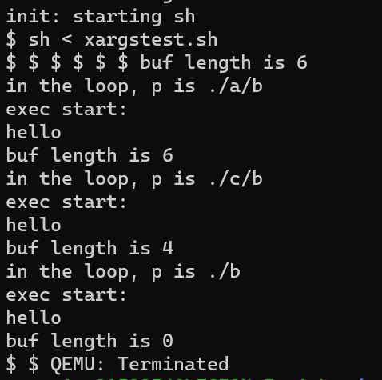
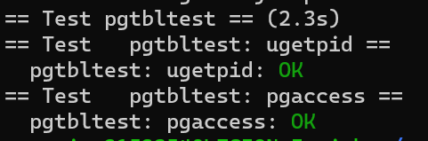
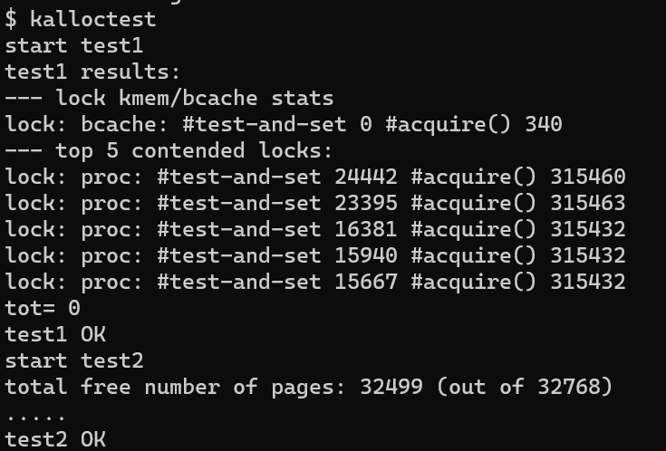
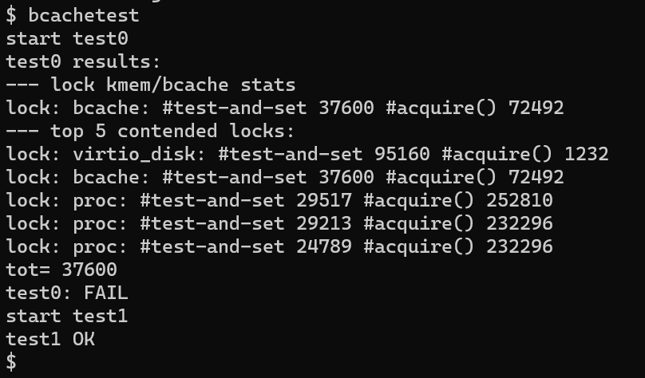
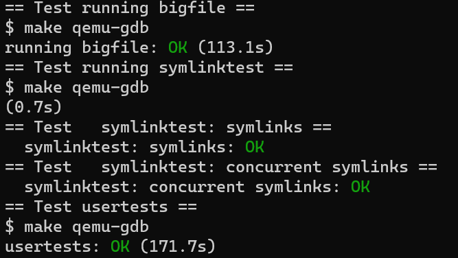

# Xv6 —— a simple Unix-like teaching operating system

<center>
2152354 张恺瑞
</center>
<center>
Tongji University, 2023 Summer
</center>
<center>
源代码：
<a href="https://github.com/Iuriak/OS-Xv6-Lab-2023">https://github.com/Iuriak/OS-Xv6-Lab-2023</a>
</center>
<center>
各实验详细代码可切换至不同Branch查看
</center>


[TOC]

## Tools

### 安装WSL并启用虚拟化

1. 下载 [Windows Subsystem for Linux](https://docs.microsoft.com/en-us/windows/wsl/install-win10) 和 [Ubuntu 20.04 from the Microsoft Store](https://www.microsoft.com/en-us/p/ubuntu/9nblggh4msv6)。

   在Windows中，可以访问*"\\wsl$"*目录下的所有WSL文件。例如，Ubuntu 20.04的主目录应该在*"\\wsl$Ubuntu-20.04\home<username>\"*。

   ```
   C:\Windows\System32>wsl --install
   适用于 Linux 的 Windows 子系统已安装。
   ```

2. 检查WSL2的要求：win+R打开运行，输入winver检查Windows版本，版本要求大于1903

   

   3. 启用虚拟化命令：以管理员打开powershell输入：

      ```
      C:\Windows\System32>dism.exe /online /enable-feature /featurename:VirtualMachinePlatform /all /norestart
      部署映像服务和管理工具
      版本: 10.0.22621.1
      映像版本: 10.0.22621.1848
      启用一个或多个功能
      [==========================100.0%==========================]
      操作成功完成。
      ```

   4. 下载X64的[WSL2 Linux内核升级包](https://wslstorestorage.blob.core.windows.net/wslblob/wsl_update_x64.msi)并安装，设置WSL默认版本

      ```
      C:\Windows\System32>wsl --set-default-version 2
      有关与 WSL 2 的主要区别的信息，请访问 https://aka.ms/wsl2
      操作成功完成。
      ```

   5. 安装Ubuntu

      ```
      C:\Windows\System32>wsl --install -d Ubuntu 20.04 LTS
      ...
      Enter new UNIX username: reverie_2152354
      New password:ka*******08(输入时全部隐藏了)
      Retype new password:ka*******08(输入时全部隐藏了)
      passwd: password updated successfully
      Installation successful!
      ```

### 软件源更新和环境准备

启动Ubuntu，安装本项目所需的所有软件，运行：

```shell
$ sudo apt-get update && sudo apt-get upgrade
$ sudo apt-get install git build-essential gdb-multiarch qemu-system-misc gcc-riscv64-linux-gnu binutils-riscv64-linux-gnu
```

### 测试安装

```shell
$ qemu-system-riscv64 --version
```


```shell
$ riscv64-linux-gnu-gcc --version
```


### 编译内核

下载xv6内核源码

```shell
$ git clone git://github.com/mit-pdos/xv6-riscv.git
```

更新镜像源

```shell
$ sudo nano /etc/apt/sources.list
$ sudo apt-get update
```

## Guidance

### 调试解决方案的技巧

- 通过插入打印语句来检查代码的问题。
- 要在xv6中使用gdb，在一个窗口中运行make make qemu-gdb，在另一个窗口中运行gdb（或riscv64-linux-gnu-gdb），设置一个断点，然后按下'c'（继续），xv6将运行到断点。(参见[使用GNU调试器](https://pdos.csail.mit.edu/6.828/2019/lec/gdb_slides.pdf)了解有用的GDB提示）。
- 如果你想看看编译器为内核生成的汇编是什么，或者想知道在一个特定的内核地址上的指令是什么，请看文件`kernel.asm`，这是Makefile在编译内核时产生的。(Makefile也为所有用户程序生成`.asm`文件）。
- 如果内核崩溃，它将打印一条错误信息，列出它崩溃时的程序计数器的值；你可以搜索`kernel.asm`来找出它崩溃时程序计数器在哪个函数中，或者你可以运行 addr2line -e kernel/kernel pc-value（运行man addr2line了解详情）。
  如果你想得到回溯，用gdb重新启动：在一个窗口运行 "`make qemu-gdb`"，在另一个窗口运行gdb（或者riscv64-linux-gnu-gdb），在panic（'b panic'）设置断点，接着按'c'（继续）。当内核到达断点时，输入'bt'来获得回溯。
- 如果你的内核挂起（例如，由于死锁）或不能进一步执行（例如，由于在执行内核指令时发生了页面错误），你可以用gdb来找出它挂起的地方。在一个窗口中运行 "`make qemu-gdb`"，在另一个窗口中运行gdb（riscv64-linux-gnu-gdb），然后按 "c"（继续）。当内核出现挂起时，在qemu-gdb窗口中按下Ctrl-C，然后输入'bt'来获得回溯。
- `qemu`有一个 "监视器"，让你查询仿真机的状态。你可以通过输入control-a c（"c "是指控制台）来获得它。一个特别有用的监视器命令是`info mem`，用来打印页面表。你可能需要使用`cpu`命令来选择`info mem`查看的内核，或者你可以用`make CPUS=1 qemu`来启动qemu，使其只有一个内核。

# :writing_hand:Lab 1: Xv6 和 Unix 实用程序

## 实验概述

本实验我们将熟悉xv6及部分重要的系统调用。

### 启动 xv6

1. 获取Lab xv6源代码，查看`util`分支：

   ```shell
   $ git clone git://g.csail.mit.edu/xv6-labs-2021
   Cloning into 'xv6-labs-2021'...
   ...
   $ cd xv6-labs-2021
   $ git checkout util
   ```
   
   

   xv6-labs-2021 repository 与书中的 xv6-riscv 略有不同；它主要增加了一些文件，可以通过下列命令查看git日志：`$ git log`

   Git 允许跟踪我们对代码所做的修改。例如，如果你完成了其中一个练习，想检查一下你的进度，你可以通过运行以下程序提交你的修改：

   ```shell
$ git commit -am 'my solution for util lab exercise 1'
   Created commit 60d2135: my solution for util lab exercise 1
    1 files changed, 1 insertions(+), 0 deletions(-)
   $
   ```
   
   可以使用 `git diff` 命令来跟踪改动。运行 `git diff` 将显示自上次提交后代码的修改，而 `git diff origin/util` 将显示相对于初始 xv6-labs-2021 代码的修改。这里，origin/xv6-labs-2021 是该类初始代码的 git 分支名称。

2. 构建并运行xv6：

   ```shell
   reverie_2152354@LEGION-Iuriak:~/xv6-labs-2021$ make qemu
   ...
   xv6 kernel is booting
   
   hart 2 starting
   hart 1 starting
   init: starting sh
   $
   ```

   如果在prompt下键入ls，应该会看到类似下面的输出：

   ```shell
   $ ls
   .              1 1 1024
   ..             1 1 1024
   README         2 2 2226
   xargstest.sh   2 3 93
   cat            2 4 23904
   echo           2 5 22736
   forktest       2 6 13096
   grep           2 7 27264
   init           2 8 23840
   kill           2 9 22712
   ln             2 10 22664
   ls             2 11 26136
   mkdir          2 12 22808
   rm             2 13 22800
   sh             2 14 41672
   stressfs       2 15 23808
   usertests      2 16 156024
   grind          2 17 37984
   wc             2 18 25048
   zombie         2 19 22200
   console        3 20 0
   $
   ```

   这些是mkfs包含在初始文件系统中的文件，大多数是我们可以运行的程序，键入ls便是运行了其中一个。

   xv6没有ps命令，但是如果输入`Ctrl-p`，内核会打印每个进程的信息。现在紧接着尝试输入，我们可以看到两行：一行是init，一行是sh。

   

3. 如果需要退出`qemu`，键入 `Ctrl-a x`即可.

## sleep

### 实验目的

1. 为xv6实现UNIX程序sleep。
2. 实现的sleep应当按用户指定的ticks数暂停，其中tick是xv6内核定义的时间概念，即定时器芯片两次中断之间的时间。解决方案应该在文件`user/sleep.c`中。

### 实验步骤

1. 在开始编码之前，阅读[xv6 book](https://pdos.csail.mit.edu/6.828/2021/xv6/book-riscv-rev2.pdf)的第1章，并查看`user/`中的其他程序（例如`user/echo.c`、`user/grep.c`和`user/rm.c`），了解如何获取传递命令行参数给程序。

2. 在命令行中，您可以运行以下命令来打开文件并查看其内容：`$ vim user/echo.c`
   可以使用任何文本编辑器打开文件，例如 Vim、Nano、Gedit 等。在 Vim 编辑器中打开文件后，要退出并返回终端命令行界面，可以按照以下步骤操作：

   1. 如果您处于编辑模式（Insert Mode），请按下 Esc 键，以确保切换到正常模式（Normal Mode）。

   2. 在正常模式下，输入冒号（:）字符，会在命令行底部出现一个冒号提示符。

   3. 输入 `:q`，然后按下回车键，执行退出命令。
   4. 如果您对文件进行了修改并希望保存更改，输入 `:wq` 以保存更改。

   此外，还可以使用 `cat` 命令来显示文件的内容。例如，运行以下命令来查看文件内容：`cat user/echo.c`
   `cat` 命令会将文件的内容直接输出到终端。

   使用 less 命令：`less` 命令是一个分页查看器，用于逐页查看文件内容（使用空格键向下翻页，使用 b 键向上翻页，按下 q 键退出）。例如，运行以下命令来查看文件内容：`less user/echo.c`

3. 通过 `kernel/sysproc.c` 中的 `sys_sleep` 获取实现`sleep`系统调用的xv6内核代码；通过 `user/user.h`获取可从用户程序调用`sleep`的C语言定义；通过 `user/usys.S`获取从用户代码跳转到内核以实现`sleep`的汇编代码。

   ```c
   // user/user.h
   struct stat;
   struct rtcdate;
   
   // system calls
   int fork(void);
   int exit(int) __attribute__((noreturn));
   int wait(int*);
   ...
   int sleep(int);
   
   // ulib.c
   int stat(const char*, struct stat*);
   ...
   void fprintf(int, const char*, ...);
   int atoi(const char*);
   ```

4. 在程序中使用系统调用`sleep`，其中命令行参数以字符串形式传递，可以使用`atoi`（参见`user/ulib.c`）将其转换为整数。最后，需要确保`main`调用`exit()`以退出程序。此外如果用户忘记传递参数，sleep应打印错误信息。

   使用vim编辑器修改sleep程序：

   ```c
   int main(int argc, char *argv[])
   {
     if (argc < 2)
     {
       fprintf(2, "need a param");
       exit(1);
     }
     int i = atoi(argv[1]);
     sleep(i);
     exit(0);
   }
   ```

   在编写时，使用到 `argc` 整数参数，其值是程序运行时命令行参数的数量加上 1（1 表示可执行文件的名称本身也作为一个参数传递给程序）。通过检查 `argc` 的值，程序判断是否提供了足够的命令行参数。如果 `argc` 的值小于 2，说明没有传递足够的参数（此处要求至少传递一个参数），程序输出错误消息并调用 `exit(1)` 终止程序的执行。

   命令行参数在 `argv` 数组中以字符串形式存储，并可以通过索引访问。`argv[0]` 存储的是可执行文件的名称，而 `argv[1]`、`argv[2]` 等存储的是传递给程序的其他命令行参数。

5. 将编写好的`sleep`程序添加到Makefile的`UPROGS`中；一旦完成，`make qemu`将编译您的程序，并且可以在 xv6 shell 中运行程序。

   1. 添加`sleep`目标程序：输入命令行`$ vim Makefile`打开`Makefile`文件，在 `Makefile` 中找到名为 `UPROGS` 的行，这是一个定义用户程序的变量。在 `UPROGS` 行中，添加 `sleep` 程序的目标名称：`$U/_sleep\`。

   2. 编译运行程序：在终端中，运行 `make qemu` 命令编译 xv6 并启动虚拟机，随后通过测试程序来检测sleep程序的正确性。

      


### 实验中遇到的问题和解决方法

1. 根据 `kernel/sysproc.c` 中的代码， `sys_sleep` 函数是实现 `sleep` 系统调用的关键。它通过获取用户传递的 tick 数（通过 `argint` 函数获取），然后在一个循环中进行暂停。在每次循环中，它检查是否达到了指定的 tick 数，如果没有，则调用 `sleep` 函数将进程置为睡眠状态，并释放 `tickslock`。

   ```c
   // kernel/sysproc.c
   uint64
   sys_sleep(void)
   {
     int n;
     uint ticks0;
   
     if(argint(0, &n) < 0)
       return -1;
     acquire(&tickslock);
     ticks0 = ticks;
     while(ticks - ticks0 < n){
       if(myproc()->killed){
         release(&tickslock);
         return -1;
       }
       sleep(&ticks, &tickslock);
     }
     release(&tickslock);
     return 0;
   }
   ```

   因此我需要在 `user/sleep.c` 中编写一个与 `sys_sleep` 对应的用户程序函数 `sleep`。该函数将负责向内核发起 `sleep` 系统调用，并将用户传递的 tick 数作为参数传递给内核，在传递参数时，起初出现了不匹配的现象，后来仔细阅读发现，系统中有可以将命令行参数转换为整数的 `atoi` 函数。

3. 为了使用 `sleep` 函数，用户程序需要包含一系列相关的头文件，在确定所需头文件的过程中，我通过阅读 `user/user.h` 等头文件并结合控制台报错信息来确定需要在 `main` 函数中使用的头文件，最终成功调用 `sleep` 函数。

### 实验心得

1. 实验时，我们需要弄清楚需要编写的程序的功能，并且阅读该程序相关的依赖文件，理清参数传递和头文件依赖关系等，避免参数传递出错或缺少头文件等。
2. 在编译并运行 `sleep` 程序之前，我们除了需要正确配置 xv6 环境之外，还需要及时让系统支持并正确实现 `sleep` 系统调用，否则程序将无法被系统调用并运行测试。

## pingpong

### 实验目的

1. 通过编写一个程序，了解UNIX系统的pingpong方法：使用 UNIX 系统调用通过一对管道在两个进程之间“ ping-pong”一个字节，每个管道对应一个方向。父进程应该向子进程发送一个字节；子进程应该打印"<pid>: received ping"，其中<pid>是它的进程ID，将管道上的字节写给父进程，然后退出；父进程应该从子进程读取字节，打印"<pid>: received pong"后退出。解决方案应该在文件`user/pingpong.c`中。
2. 理解父进程和子进程的关系及其执行顺序。学习使用管道进行进程间通信，实现父进程和子进程之间的数据交换。
3. 掌握进程同步的概念，确保父进程和子进程在适当的时机进行通信。

### 实验步骤

1. 在`user/user.h`中查看xv6上的用户程序的一组库函数；并在user/ulib.c、user/printf.c和user/umalloc.c中查看其他源代码（系统调用除外）。

2. 使用 `pipe` 创建管道。

   ```c
   pipe(parent_fd);// Calling pipe creates a parent pipe
   pipe(child_fd);	// Calling pipe creates a child pipe
   ```

3. 使用`fork`创建子管道。

4. 使用 `read` 从管道中读取数据，使用 `write` 向管道中写入数据。

5. 使用 `getpid` 查找调用进程的进程 ID。

6. 将程序添加到 Makefile 的 `UPROGS` 中。

7. 运行并测试程序，在xv6 shell中运行该程序，输出结果如下：

   ```shell
   $ pingpong
   4: received ping
   3: received pong
   $
   ```
   
8. 如果程序在两个进程之间交换一个字节并产生上述输出，说明程序正确。
   
   

程序源码：

```c
...
  // Creating child processes with fork
  if (fork() == 0)
  {
    char buf[10];	// For storing read data
    read(parent_fd[0], buf, sizeof buf); // Read data from parent_fd[0], read data stored in buf
    int id = getpid();	// Get the ID of the current process and print it
    printf("%d: received %s\n", id, buf);
    write(child_fd[1], "pong", 4);	// Write string "pong" to child_fd[1] pipe
    // Close the read side and write side of child_fd.
    close(child_fd[0]);
    close(child_fd[1]);
  }
  else
  {
    char buf[10];
    int id = getpid();
    write(parent_fd[1], "ping", 4);	// Write the string "ping" to the parent_fd[1] pipe and close the write side of that pipe
    close(parent_fd[1]);
    int status;
    wait(&status);
    read(child_fd[0], buf, sizeof buf);
    printf("%d: received %s\n", id, buf);
    close(child_fd[0]);
  }
```

### 实验中遇到的问题和解决方法

在实验中，有这么一段要求：**父进程向子进程发送一个字节，随后子进程打印"<pid>: received ping"，将pipe字节写如入父进程后退出，父进程再从子进程读取字节，打印"<pid>: received pong"后退出。**起初我因为忽视了这一段要求中的逻辑而导致程序编写不尽完善，这其实对于父子进程的先后逻辑关系做出了要求。因此我使用了一个 `wait()` 函数，在父进程中用于等待子进程的结束，并获取子进程的退出状态。通过这样一种同步机制来确保父进程在子进程完成之后继续执行。

如果在父进程中不使用 `wait()` 函数，尽管本次的测试结果与不使用`wait()` 函数的结果相一致，但父进程可能会在子进程执行完成之前继续执行自己的代码。这可能会导致父进程在子进程还没有完成时就退出，从而使子进程成为孤儿进程（没有父进程的进程）。此外，没有正确等待子进程完成的父进程可能无法获取子进程的退出状态，也无法做进一步的处理。

### 实验心得

在本次实验中，我成功编写了 `pingpong.c` 程序，通过父进程和子进程之间的管道实现了数据的交换。在实验过程中，我遇到了一些挑战，也收获了学习心得：

1. 进程间通信的重要性：本次实验让我认识到进程间通信在多进程编程中的重要性。使用管道作为通信机制，可以在父进程和子进程之间传递数据，实现数据的共享和交换。
2. 进程同步的关键：实现正确的进程同步是实验中的关键。通过适当的管道读写操作和进程等待机制（如使用 `wait()` 函数），我成功实现了父进程和子进程的同步，确保了数据的正确交换和打印顺序。
3. 熟悉管道的使用：通过编写 `pingpong` 程序，我更加熟悉了管道的使用。我学会了创建管道、通过文件描述符进行读写操作，以及如何关闭管道的读写端。
4. 父子进程关系的理解：通过观察和分析父进程和子进程的输出顺序，我对父子进程之间的关系有了更深入的理解。我了解到子进程是由父进程派生出来的，它们共享某些资源，并在不同的代码路径中执行。
5. 调试和错误处理的重要性：在实验过程中，我遇到了一些编程错误和逻辑问题。通过仔细分析错误信息、调试和追踪程序执行流程，我能够及时发现问题并进行修复。这个过程提醒我在编程中注重错误处理和调试能力的重要性。

## primes

### 实验目的

1. 使用管道编写一个基本筛选器的并发版本。想法来自于 Unix 管道的发明者 Doug McIlroy。[这页](http://swtch.com/~rsc/thread/)中间的图片和周围的文字解释了实现方法。解决方案位于 `user/primes.c` 中。

2. 学习使用`pipe`和`fork`来设置管道。第一个进程将数字2到35输入管道。对于每个素数创建一个进程，该进程通过一个管道从左边的邻居读取数据，并通过另一个管道向右边的邻居写入数据。由于xv6的文件描述符和进程数量有限，第一个进程可以在35处停止。
3. 理解并掌握进程间通信的概念和机制。
4. 学习使用管道在父子进程之间进行数据传递。

### 实验步骤

1. 创建父进程，父进程将数字2到35输入管道，此时不必创建其后所有进程，每一步迭代更新一对相对的父子进程（仅在需要时才创建管道中的进程）。

2. 对于2-35中的每个素数创建一个进程，进程之间需要进行数据传递：该进程通过一个管道从左边的父进程读取数据，并通过另一个管道向右边子进程写入数据。

3. 对于每一个生成的进程而言，当前进程最顶部的数即为素数；对每个进程中剩下的数进行检查，如果是素数则保留并写入下一进程，如果不是素数则跳过。
   

4. 完成数据传递或更新时，需要及时关闭一个进程不需要的文件描述符（防止程序在父进程到达35之前耗尽xv6的资源）。

5. 在数据传递的过程中，父进程需要等待子进程的结束，并回收共享的资源和数据等，即一旦第一个进程到达35，它应该等待直到整个管道终止，包括所有子进程、孙进程等。因此，主primes进程应该在所有输出都打印完毕，并且所有其他primes进程都退出后才退出。

6. 按照上述逻辑完成`primes.c`的编写。

7. 在Makefile中将程序添加到`UPROGS`中。

8. 编译运行并测试`primes.c`

   

程序主要源代码：

```c
int main(int argc, char *argv[])
{
  int first, v;
  // 用于在父进程和子进程之间交换管道文件描述符。
  int *fd1, *fd2;
  // 创建第一个管道和之后的管道
  int first_fd[2], second_fd[2];
  pipe(first_fd);
  // 创建父进程
  if (fork() > 0){
    ...
    // 将数字2-35输入管道
    // 输入后关闭写
    close(first_fd[1]);
    // 等待子进程结束...
    wait(&status);
  }
  // 对于子进程，循环处理，为素数创建新进程
  else{
    // 子进程从 first_fd 管道中读取数据，并创建一个新的管道 fd2
    fd1 = first_fd;
    fd2 = second_fd;
    while (1){
      // 创建一个管道，为下一次读取做准备。
      pipe(fd2);
      // 子进程关闭了前一个管道的写端，从管道 fd1 中读取第一个值(素数)并打印
      close(fd1[1]);
      ...
      // 子进程遍历读取 fd1 管道的剩余值，对每个值进行判断
      if (fork() > 0){
        int i = 0;
        while (read(fd1[0], &v, sizeof(v))){
          // 如果可以整除 first（当前素数），则跳过该值，继续下一个
          if (v % first == 0)
            continue;
          i++;
          // 如果不可以整除，则将该值写入 fd2 管道中，以供下一个子进程使用。
          write(fd2[1], &v, sizeof(v));
        }
        // 关闭fd1的读端和fd2的写端，并等待子进程结束
        ...
        int status;
    	wait(&status);
        break;
      }
      // 子进程之间数据的传递
      else{
        close(fd1[0]);//close fd1 read
        int *tmp = fd1;
        fd1 = fd2;
        fd2 = tmp;
      }
    }
  }
  //父进程在子进程结束后退出
  exit(0);
}
```

### 实验中遇到的问题和解决方法

起初父子进程的逻辑处理和数据传递让我感到疑惑，后来我对`fork()` 函数系统调用进行了深入理解：它用于创建一个新的进程（子进程）作为当前进程（父进程）的副本，子进程会继承父进程的代码、数据、堆栈和文件描述符等资源的副本。子进程和父进程在 `fork()` 调用点之后的代码是独立执行的，并且拥有各自独立的地址空间。因此，父进程和子进程可以在 `fork()` 后继续执行不同的逻辑，实现并行或分支的程序控制流程。因此数据如果要实现传递，则可以在`fork()`判定为子进程的分支上进行数据“交换”，将子变为下一级的父，从而实现了数据传递。从中我解决了程序的逻辑问题，而且更加理解了父子进程的关系，以及父子进程之间的相对关系。

### 实验心得

实验中

- 在这个实验中，我成功地编写了一个素数查找程序，来实现基于管道的基本并发筛选器功能，并使用了管道进行父子进程之间的通信。
- 通过编写这个程序，我深入理解了 `fork()` 函数的作用和使用方法，以及管道的基本原理和用法。
  * 对于父进程，`fork()` 函数返回子进程的进程ID（PID），即大于 0 的整数值。
  * 对于子进程，`fork()` 函数返回 0。
  * 如果创建子进程失败，`fork()` 函数返回一个负值，表示创建进程的失败。
- 在编写过程中，我遇到了一些问题，如如何处理管道的读写端关闭以及需要注意父子进程关系，但通过调试和查阅资料，我解决了这些问题。
- 通过实验，我对操作系统中进程的创建和通信有了更深入的了解，对于并发编程有了更好的理解。

## find

### 实验目的

1. 学习并编写一个简单版本的UNIX查找程序：程序应当实现查找目录树中带有特定名称的所有文件，解决方案位于文件`user/find.c`中。
2. 理解文件系统中目录和文件的基本概念和组织结构。
3. 熟悉在 xv6 操作系统中使用系统调用和文件系统接口进行文件查找操作。
4. 应用递归算法实现在目录树中查找特定文件。

### 实验步骤

1. 首先查看`user/ls.c`以了解如何读取目录。
   `user/ls.c`中包含一个`fmtname` 函数，用于格式化文件的名称。它通过查找路径中最后一个 `'/'` 后的第一个字符来获取文件的名称部分。如果名称的长度大于等于 `DIRSIZ`，则直接返回名称。否则，将名称拷贝到一个静态字符数组 `buf` 中，并用空格填充剩余的空间，保证输出的名称长度为 `DIRSIZ`。

   ```c
   char *fmtname(char *path)
   {
       static char buf[DIRSIZ + 1];
       char *p;
       // Find first character after last slash.
       for (p = path + strlen(path); p >= path && *p != '/'; p--);
       p++;
       // Return blank-padded name.
       if (strlen(p) >= DIRSIZ)
           return p;
       memmove(buf, p, strlen(p));
       memset(buf + strlen(p), ' ', DIRSIZ - strlen(p));
       return buf;
   }
   ```
   
2. `main` 函数完成参数检查和功能函数的调用：检查命令行参数的数量，如果参数数量小于 3，则输出提示信息并退出程序。否则，将第一个参数作为路径，第二个参数作为要查找的文件名称，调用 `find` 函数进行查找，并最后退出程序。

3. 编写一个`match` 函数：`match` 函数用于检查给定的路径和名称是否匹配，通过查找路径中最后一个 `'/'` 后的第一个字符来获取文件的名称部分，然后与给定的名称进行比较。如果匹配，则返回 1，否则返回 0。

   ```c
   int match(char *path, char *name)
   {
       char *p;
       // 查找最后一个'/'后的第一个字符
       for (p = path + strlen(path); p >= path && *p != '/'; p--);
       p++;
       if (strcmp(p, name) == 0)
           return 1;
       else
           return 0;
   }
   ```
   
4. 编写一个`find` 函数：用于递归地在给定的目录中查找带有特定名称的文件。首先打开目录，并使用 `fstat` 函数获取目录的信息。根据目录的类型进行不同的处理。

   - 如果是文件（`T_FILE`），则使用 `match` 函数检查文件名称是否与给定的名称匹配，如果匹配则打印文件的路径。
   - 如果是目录（`T_DIR`），则遍历目录中的每个文件。首先，检查拼接后的路径长度是否超过了缓冲区 `buf` 的大小。如果超过了，则输出路径过长的提示信息。然后，将路径拷贝到 `buf` 中，并在路径后添加 `'/'`。接下来，循环读取目录中的每个文件信息，注意不要递归到 `'.'` 和`'..'`，跳过当前目录 `'.'` 和上级目录 `'..'`。将文件名拷贝到 `buf` 中，并使用递归调用 `find` 函数在子目录中进行进一步查找。（比较时要注意： == 不能像 Python 那样比较字符串，使用 `strcmp()` 代替）
   - 关闭目录文件描述符。

5. 程序包含了各类函数的及其功能如下：

   | 函数      | 功能                                                         |
   | --------- | ------------------------------------------------------------ |
   | `match`   | 判断文件名是否与指定名称匹配                                 |
   | `fmtname` | 格式化输出文件名称                                           |
   | `find`    | 通过打开目录、读取目录内容以及递归调用自身实现对目录树的遍历 |
   | `main`    | 对命令行参数进行检查，并调用 `find` 函数进行查找             |

6. 在Makefile中将程序添加到`UPROGS`中。

7. 编译运行并测试`find.c`：运行中需要注意，对文件系统的修改会在运行 qemu 时持续存在；要获得一个干净的文件系统，运行 `make clean`，然后再运行 `make qemu`。

8. 得到输出结果：

   ```shell
   $ make qemu
   ...
   init: starting sh
   $ echo > b
   $ mkdir a
   $ echo > a/b
   $ find . b
   ./b
   ./a/b
   $ find a b
   a/b
   $
   ```

   

### 实验中遇到的问题和解决方法

实验中，我参考了目录相关操作的程序的写法，但在参考的基础上编写`find`函数的过程中出现了不少问题：

* 在 `find` 函数的编写过程中，我参考了`ls.c`中的`ls`函数的写法，而`ls.c`主要用于列出指定路径下的文件和目录信息，因此其结果的输出格式与本实验需求不同，这个问题起初我并未注意到。
* 此外，`ls.c`的输入仅仅需要一个文件地址参数，而文件查找需要路径path和查找文件名name两个参数，如上述测试使用了`find . b`和`find a b`，都提供了两个参数，因此函数的输入也需要做出相应的修改
* `ls.c`程序只能提供基本的文件和目录信息，并不包含递归遍历子目录的功能。因此如果我不对 `find` 函数进行递归遍历，它只能查找指定目录下的直接子文件和子目录，而无法继续向下递归地查找子目录中的文件，这也会导致我在测试时无法得到全面的查找结果。

### 实验心得

- 通过编写 `find.c` 程序，我深入理解了文件系统中目录和文件的关系，以及如何通过系统调用和文件系统接口来访问和操作文件。
- 在编写 `find.c` 过程中，我学会了使用递归算法实现对目录树的深度遍历，以便能够在整个目录结构中查找符合条件的文件。
- 通过实验，我通过阅读相似功能的源代码，进一步掌握了在 xv6 操作系统中进行文件操作的技巧和方法，如打开文件、读取目录等。
- 实验过程中遇到了一些问题，例如理解文件系统的目录结构和文件的属性，以及如何正确处理文件路径等。但通过查阅文档和调试代码，我逐渐解决了这些问题，并提高了对文件系统的理解和应用能力。

## xargs

### 实验目的

1. 编写一个UNIX xargs程序的简单版本：从标准输入中读取行，并为每一行运行一个命令，将行作为参数提供给命令。解决方案位于文件`user/xargs.c`中。
2. 熟悉命令行参数的获取和处理：实验需要读取命令行参数并进行适当的处理，包括选项解析和参数拆分。
3. 学习外部命令的执行：实验中需要调用exec函数来执行外部命令，理解执行外部程序的基本原理。

### 实验步骤

1. 通过示例理解xarg的工作原理：

   ```shell
   $ echo hello too | xargs echo bye
   bye hello too
   $
   ```

   注意这里的命令是 "echo bye"，附加参数是 "hello too"，因此命令是 "echo bye hello too"，输出 "bye hello too"。

   > 请注意，UNIX上的xargs进行了优化，它将一次向命令提供多个参数。实验中无需做这样的优化。为了使UNIX上的xargs按照实验中的方式运行，在运行时需要将-n选项设置为1。例如：
   >
   > ```shell
   > $ echo "1\n2" | xargs -n 1 echo line
   > line 1
   > line 2
   > $
   > ```
   >
   > 又例如，xargs、find和grep组合在一起能够很好地运行：
   > `$ find . b | xargs grep hello`将对". "以下目录中名为b的每个文件运行 "grep hello"。

2. 读取用户输入：要读取单行输入，每次读取一个字符，直到出现换行符('\n')。

   ```c
   int buf_len = strlen(buf);  // 获取读取到的字符串的长度
   // printf("buf length is %d\n", buf_len);
   if (buf_len < 1)
       break;
   argv_len = argc - 1;
   buf[buf_len - 1] = '\0'; // 将读取到的字符串中的换行符替换为字符串结束符
   ```

3. 将输入的字符串按照单词拆分出参数：利用`kernel/param.h`声明的`MAXARG`，用于检查声明的数组中参数个数是否超出限制。

   ```c
   // 把buf中读取到用户输入的内容按照word拆分到每个new_argv中
   for (char *p = buf; *p; p++){
       // 跳过连续的空格字符，p指向第一个非空格字符，将空格替换为结束符
       while (*p && (*p == ' '))
           *p++ = '\0';
       if (*p){
           // 检查参数个数是否超过了限制
           if (argv_len >= MAXARG - 1){
               printf("Too many arguments\n");
               exit(1);
           }
           new_argv[argv_len++] = p;
       }
       // 跳过当前参数剩余字符，p指向下一个空格字符或字符串结束符
       while (*p && (*p != ' '))
           p++;
   }
   ```
   
4. 使用 `fork` 和 `exec` 在每一行输入上调用命令：在父进程中使用`wait`等待子进程完成命令。在子进程中修改`exec`的调用方法，在执行命令时将每个参数逐个提供给`exec`函数以符合实验要求，即不一次性向命令提供多个参数，而是每次提供一个参数。

5. 在Makefile中将程序添加到`UPROGS`中。

6. 编译运行并测试`find.c`：运行中需要注意，对文件系统的修改会在运行 qemu 时持续存在；要获得一个干净的文件系统，运行 `make clean`，然后再运行 `make qemu`。

7. 运行结果：

   ```shell
   $ make qemu
   ...
   init: starting sh
   $ sh < xargstest.sh
   $ $ $ $ $ $ hello
   hello
   hello
   $ $   
   ```

   

### 实验中遇到的问题和解决方法 

在实验中，当输出结果不一致时，由于输出结果包含三行“hello”，且测试程序透明，因此不易发现出错环节。为了更好的修改代码，我添加了不少用于检查运行状况的命令行提示文字输出，如`printf("buf length is %d\n", buf_len);`用于检查当前字符串长度；`printf("in the loop, p is %s\n", p);`用于检查当前参数内容；`printf("exec start: \n");`用于确保`exec`传参正确开始进行，这使得我对运行的逻辑更加清晰了。



### 实验心得

1. 参数处理：实验要求将输入按照空格拆分为多个参数，并将它们作为命令行参数传递给外部命令。我学会了如何处理命令行中的输入字符串，跳过空格，并将参数存储在适当的数据结构中。
2. 外部命令执行：通过调用exec函数执行外部命令，我深入了解了进程创建和替换的过程。了解了如何在子进程中执行外部程序，并将程序路径和参数传递给exec函数。
3. 错误处理：在编写实验代码时，我学会了处理错误情况并进行适当的错误报告。例如，当参数个数超过限制或无法执行外部命令时，我通过输出错误信息和退出程序来处理这些情况。

# :writing_hand:Lab 2: System calls

## 实验综述

在[Lab 1](#:writing_hand:Lab 1: Xv6 和 Unix 实用程序)中，我使用系统调用编写了一些实用程序。在Lab 2中，我们将为xv6添加一些新的系统调用，这将帮助我理解它们是如何工作的，并让我接触到xv6内核的一些内部特性。

在开始编码之前，请阅读[xv6 book](https://pdos.csail.mit.edu/6.828/2021/xv6/book-riscv-rev1.pdf)的第2章、第4章的第4.3节和第4.4节以及相关源文件：

* 系统调用的用户空间代码在`user/user.h`和`user/usys.pl`中。

* 内核空间代码是`kernel/syscall.h`和`kernel/syscall.c`。

* 与进程相关的代码是`kernel/proc.h`和`kernel/proc.c`。

* 开始实验，切换到 `syscall` 分支：

  ```shell
    $ git fetch
    $ git checkout syscall
    $ make clean
  ```


## System call tracing

### 实验目的

本实验旨在帮助了解系统调用跟踪的实现，以及如何修改 xv6 操作系统以添加新功能。我们需要添加一个有助于调试的新的`trace`系统调用。该功能包括创建一个名为 `trace`的系统调用，并将整数  "`mask`"作为参数。 "`mask`"的位数表示要跟踪哪些系统调用。通过实验，熟悉内核级编程，包括修改进程结构、处理系统调用和管理跟踪掩码。

### 实验步骤

1. 在 Makefile 的 `UPROGS` 中添加 `$U/_trace`
2. 定义 trace 系统调用的原型, entry 和系统调用号

   - 在 `user/user.h`中添加 trace 系统调用原型：

     ```c
     int trace(int);	// lab 2.1
     ```

   - 在 `user/usys.pl` 脚本中添加 trace 对应的 entry

     ```c
     entry("trace");	# lab 2.1
     ```
   - 在 `kernel/syscall.h` 中添加 trace 的系统调用号

     ```c
     #define SYS_trace 22	// lab 2.1
     ```


3. 编写 trace 的系统调用函数

   - 在`kernel/sysproc.c`中添加一个`sys_trace()`函数，通过在`proc`结构（参见`kernel/proc.h`）中的一个新变量`tracemask`来存储参数来实现新的系统调用。

     ```c
     uint64 sys_trace(void) {
         int mask;
         // 获取整数类型的系统调用参数
         if (argint(0, &mask) < 0) {
             return -1;
         }
         // 存入proc 结构体的 mask 变量中
         myproc()->tacemask = mask;
         return 0;
     }
     ```

     结构体 `struct proc` 的定义在 `kernel/proc.h` 中，该结构体记录着进程的转态。成员变量主要分为公有变量和私有变量，公有变量访问是需要加锁的.，而此处需要为 trace 系统调用添加一个变量 `tracemask` 来记录其参数。因为 trace 只会在本进程发挥作用，所以 tracemask 应该作为进程的私有变量。

4. 修改 `fork()` 函数（参见`kernel/proc.c`），将父进程的跟踪掩码复制到子进程。

5. 修改`kernel/syscall.c`中的`syscall()`函数以打印跟踪输出。

   ```c
   if ((1 << num) & p->mask) {    // 判断掩码是否匹配
   	printf("%d: syscall %s -> %d\n", p->pid, syscalls_name[num], p->trapframe->a0);
   }
   ```

   此外需要添加一个`syscalls_name`数组，使用系统调用名称来索引。

6. 在 `kernel/syscall.c` 中添加 trace 调用：

   * 添加 `sys_trace()` 的外部声明

     ```c
     extern uint64 sys_trace(void);
     ```

   * 添加 `syscalls` 函数指针的对应关系

     ```c
     static uint64 (*syscalls[])(void) = {
         ...
         [SYS_trace] sys_trace,      // lab 2.1
     };
     ```

7. 结果测试：

   * `trace`调用grep只跟踪read系统调用。

   

   * `trace`运行grep，同时跟踪所有系统调用；2147483647的31位低位全部被设置。

   

   * 程序没有被跟踪，因此没有打印跟踪输出。

   

   * `$ trace 2 usertests forkforkfork`，跟踪了 usertests 中 `forkforkfork` 测试的所有后代的 fork 系统调用。：

     

     

### 实验中遇到的问题和解决方法

**用户态和内核态之间的数据传递：** 在系统调用的实现中，需要正确地传递参数和数据，包括用户态和内核态之间的切换。起初这让我很困惑，但是我通过仔细阅读系统调用相关的文档和源代码，找到了正确使用数据传递方法，如使用合适的系统调用参数读取函数等。

以下是我总结的实验中涉及到的用户态和内核态之间的数据传递和状态切换的方面：

1. **系统调用参数传递：** 在实验中，用户程序通过调用 `sys_trace` 系统调用来传递一个整数参数 `mask` 给内核，用于指定要追踪的系统调用。用户程序通过 `argint` 函数将参数从用户空间传递到内核空间。
2. **内核态与用户态切换：** 当用户程序调用 `sys_trace` 系统调用时，会触发用户态切换到内核态。这个切换由系统调用机制完成。
3. **数据传递和复制：** 用户程序传递给内核的 `tracemask` 参数需要在内核中进行数据复制。当用户程序传递参数给内核时，内核需要正确地从用户空间复制数据到内核空间，以确保内核能够访问到正确的数据。
4. **数据验证和权限检查：** 在实验中，内核需要验证用户传递的 `tracemask` 参数是否合法，并确保用户程序有权限调用 `sys_trace` 系统调用。内核可以通过对 `tracemask` 进行合法性检查来防止恶意传递错误的参数。

### 实验心得

从这个实验中，我学到了如何在xv6内核中添加新的系统调用，如何修改进程控制块以支持跟踪掩码，并且理解了如何在内核中实现系统调用的功能。此外，我还了解了如何在用户级程序中调用新增的系统调用，并在实验中验证系统调用的正确性。

通过本次实验，我还体会到了调试和测试的重要性，以及如何逐步构建和验证功能。这次实验为我提供了深入了解操作系统内部运作的机会，为将来的学习打下了坚实的基础。

## Sysinfo

### 实验目的

在本实验中将添加一个系统调用 `sysinfo`，用于收集运行系统的信息。系统调用需要一个参数：指向 `struct sysinfo` 的指针（参见 `kernel/sysinfo.h`）。内核应填写该结构体的字段：`freemem` 字段应设置为可用内存的字节数，`nproc` 字段应设置为状态不是 `UNUSED` 的进程数。

### 实验步骤

1. 在 Makefile 的 `UPROGS` 中添加 `$U/_sysinfotest`

2. 在 `user/user.h` 中声明 `sysinfo()` 的原型，需要预先声明 `struct sysinfo` 的存在：

   ```c
   struct sysinfo；
   int sysinfo(struct sysinfo *)；
   ```

3. `sysinfo` 需要将 `struct sysinfo` 复制到用户空间；关于如何使用 `copyout()` 完成复制，参阅 `sys_fstat()` (`kernel/sysfile.c`) 和 `filestat()` (`kernel/file.c`)可知，需要调用 `copyout()` 函数, 该函数在 `kernel/vm.c` 中定义。

   ```c
   // 将结构体由内核态拷贝至用户态
   if (copyout(myproc()->pagetable, info_addr,
               (char *) &info, sizeof(info)) < 0)
       return -1;
   ```

4. 在 `kernel/kalloc.c` 中添加一个`getfreemem`函数，用于收集可用内存的数量：

   计算该值参考 `kernel/kalloc.c` 文件中的 `kalloc()` 和 `kfree()` 等几个函数，可以看到内核通过 `kmem.freelist` 的一个链表维护未使用的内存，链表的每个结点对应一个页表大小(PGSIZE)。分配内存时从链表头部取走一个页表大小，释放内存时会使用头插法插入到该链表。因此计算未使用内存的字节数 `freemem` 只需要遍历该链表得到链表结点数，再与页表大小（4KB）相乘即可得到空闲内存的字节数。

   ```c
   uint64 getfreemem(void) {
       uint64 n;
       struct run *r;
       // 遍历kmem.freelist链表
       for (n = 0, r = kmem.freelist; r; r = r->next) {
           ++n;
       }
       return n * PGSIZE;
   }
   ```

5. 在 `kernel/proc.c` 中添加一个`getnproc`函数，用于收集进程数：

   计算该值参考 `kernel/proc.c`文件中的 `allocproc()` 和 `freeproc()` 等函数，可以看到内核使用数组 `proc[NPROC]` 维护对应进程，分配时直接遍历数组找到一个未使用(`UNUSED`)状态的进程即可，释放时则直接将进程信息清空。

6. 编写完上述两个函数后，在 `kernel/defs.h` 中添加函数原型。

7. 我们提供了一个测试程序 `sysinfotest`；如果打印出 "`sysinfotest： OK`"，则实验通过。
   
   
   
   运行 `make grade` 测试：
   
   

### 实验中遇到的问题和解决方法

本次实验的核心在于收集系统运行的信息，比如收集可用内存的数量和进程数，因此首先遇到的困难在于要如何根据现有的源码提取出可供我们利用的参数，于是我参考了`kalloc()` 和 `kfree()` 等几个函数，可以看到内核通过 `kmem.freelist` 的一个链表维护未使用的内存，但是我不能遍历获取了可用的链表节点就认为任务完成了，我一开始忽视了链表的每个结点还对应了页表大小(PGSIZE)，PGSIZE的宏定义在源码中也有提示，所以我需要最后乘上这个页表大小才是真正获得了可用内存数。

### 实验心得

通过本次实验，我成功为系统添加了一个新的系统调用 `sysinfo`，实现了收集运行系统的信息，如可用内存数、进程数等。在完成实验的过程中，我还认真了解了实现所需的几个基础数据结构，比如kmem链表，以及表示进程状态的字段`UNUSED`等，要实现这些能够反应系统运行信息功能，我们首先需要了解这些信息分别由什么记录，这样我们才能更有针对性地对他们做出追踪和检测，因此这也更让我深刻认识到，功能的实现要基于这个系统的基础配置和数据结构，这些信息我们可以通过查阅相关资料的文字介绍和示意图来了解，也可以对照源代码去查看已有的数据结构基础。

# :writing_hand:Lab 3: Page tables

## 实验综述

本实验中将探索页面表并对其进行修改，以加快某些系统调用并检测哪些页面已被访问。

在开始编码之前，请阅读 [xv6](https://pdos.csail.mit.edu/6.828/2021/xv6/book-riscv-rev2.pdf) 一书的第 3 章及相关文件：

* `kern/mlayout.h`，用于捕捉内存布局。

* `kern/vm.c`，包含大部分虚拟内存（VM）代码。

* `kernel/kalloc.c`，包含分配和释放物理内存的代码。

* 本次实验请切换到 `pgtbl` 分支：

  ```shell
    $ git fetch
    $ git checkout pgtbl
    $ make clean
  ```

## Speed up system calls

### 实验目的

一些操作系统（如 Linux）通过在用户空间和内核之间共享只读区域中的数据来加快某些系统调用的速度。这样，在执行这些系统调用时就不需要内核交叉了。本实验旨在学习如何在页表中插入映射，首先需要在 xv6 中的 `getpid()` 系统调用中实现这一优化。

通过在用户空间和内核之间共享一个只读区域中的数据，来加速特定的系统调用。具体而言，通过在进程创建时映射一个只读页，将一个 `struct usyscall` 结构放置在该页的开头，该结构会存储当前进程的 `PID`。这将使得在执行某些系统调用时，不需要进行用户空间和内核之间的频繁切换，从而提高系统调用的性能。

### 实验步骤

1. 在 `kernel/proc.h` 的proc 结构体中添加指针来保存这个共享页面的地址。

   ```c
   struct usyscall *usyscallpage;
   ```

2. 在 `kernel/proc.c` 的 `allocproc()` 函数中，为每个新创建的进程分配一个只读页，使用 `mappages()` 来创建页表映射：

   在进程表中查找未使用的进程，如果找到，初始化在内核中运行所需的状态，并在 p->lock 保持不变的情况下返回；如果没有空闲的进程，或者内存分配失败，则返回 0。

3. 将 `struct usyscall` 结构放置在只读页的开头，并初始化其存储当前进程的 PID：

   在 `kernel/proc.c` 的 `proc_pagetable(struct proc *p)` 中将这个映射（PTE）写入 pagetable 中。我们使用 `mappages()` 函数将该页面映射到用户空间的地址 `USYSCALL` 上，并设置权限为只读。这样，在用户空间的 `ugetpid()` 函数中，可以直接读取这个页面来获取当前进程的 PID。

   ```c
   if(mappages(pagetable, USYSCALL, PGSIZE, 
                 (uint64)(p->usyscallpage), PTE_R | PTE_U) < 0) {
       uvmfree(pagetable, 0);
       return 0;
   }
   ```

4. 在 `kernel/proc.c` 的 `freeproc()` 函数中，释放之前分配的只读页。

   ```c
   if(p->usyscallpage)
       kfree((void *)p->usyscallpage);
   p->usyscallpage = 0;
   ```

5. 运行 `./grade-lab-pgtbl ugetpid` 即可得到成功信息。

   

### 实验中遇到的问题和解决方法

1. **页面映射问题：** 在进行页面映射时，我遇到了页表相关的映射问题，导致系统调用执行失败或崩溃，比如我在运行的时候得到了下面这样的报错：

   ```shell
   xv6 kernel is booting
   
   hart 2 starting
   hart 1 starting
   panic: freewalk: leaf
   ```

   - **解决方法：** 通过仔细阅读 xv6 的页表管理部分代码，我发现除了需要确保在 `allocproc()` 和 `freeproc()` 中正确创建和释放页表映射，还需要及时取消映射，因为在 `pagetable` 中任然存在我们之前的 PTE 映射。我们需要在 `kernel/proc.c` 的 `proc_freepagetable` 函数中对其取消映射。

     ```c
     uvmunmap(pagetable, USYSCALL, 1, 0);
     ```

2. **权限问题：** 在页面权限的设置上，我遇到了一些问题：如果权限设置不正确，可能导致用户空间尝试写入只读页，导致错误或崩溃。如`proc_pagetable(struct proc *p)` 中映射 PTE 时的权限应该为 `PTE_R | PTE_U` 而不是 `PTE_R | PTE_U | PTE_W`。

   - **解决方法：** 因为在 xv6 的设计中，用户程序不应该直接写入代码或数据段，这是由操作系统负责的。因此，在将这些代码和数据映射到用户页表时，不应该使用可写权限，而只需要可读权限 (`PTE_R`) 和用户权限 (`PTE_U`) 即可。在页面映射时，确保设置权限位为只读，以防止用户空间进行写操作。

### 实验心得

通过本次实验，首先我看到了性能优化的重要性，这给了我很大的启示：通过将系统调用的相关数据放在只读页中，以减少内核和用户空间之间的数据传输次数，从而加速系统调用的执行。

此外这个实验使我更深入地理解了系统调用的工作原理以及它们是如何在用户空间和内核空间之间进行通信的。这为您提供了更清晰的操作系统工作流程的认识。通过在每个进程的页表中插入只读页，掌握操作页表的方法，从而实现用户空间与内核空间之间的数据共享。尽管在实验过程中遇到了不少问题，但是这让我对映射与回收、权限授予等有了更深刻的理解。

## Print a page table

### 实验目的

深入理解 RISC-V 页表的结构和内容，并提供一个打印页表的函数 `vmprint()` 。通过这个实验，实现可视化页表的布局，了解页表的层次结构以及如何将虚拟地址映射到物理地址。

### 实验步骤

1. 在 `kernel/defs.h` 中定义 `vmprint` 的原型，以便在 `exec.c` 中调用：

   ```c
   void vmprint(pagetable_t);
   ```

2. 在 `kernel/vm.c` 中定义一个函数 `vmprint(pagetable_t pagetable)`，该函数接受一个页表作为参数。

3. 使用位操作和宏定义（位掩码和位移等）从页表项（PTE）中提取所需的信息，如 PTE 的有效位、权限位和物理地址。

4. 在 `vmprint()` 函数中，使用循环递归地遍历页表的各个级别，打印每个 PTE 的信息，并递归地调用 `vmprint()` 打印下一级的页表。在实现上，我们可以由函数 `freewalk` 带来启发：

   

   为了更加贴切地展示层级信息，可以在递归时记录层级信息，进入下一级页表层级+1，回退一级则层级-1.

5. 在 `exec.c` 的 `exec()` 函数中找到 `return argc;` 之前的位置，插入条件语句 `if(p->pid==1) vmprint(p->pagetable);`，以在执行 `init` 进程时打印第一个进程的页表。

6. 编译并运行，查看打印输出，以了解进程的页表结构。

   

### 实验中遇到的问题和解决方法

1. **递归错误：** 在递归地遍历页表时，起初在递归的设计上，思路还不太清晰，后来参考了freewalk函数的形式，让我对递归遍历的逻辑有了更好的理解。
2. **格式化输出问题：** 我在格式化输出的语法上出现了一些错误。后来我结合控制台调试，使用 `%p` 格式化符正确地打印了 64 位的十六进制 PTE 和物理地址。
3. **页表层次理解：** 在理解页表的层次结构时，可能显得过于抽象，但通过观察源码、结合课程教材中的图 3-4和解释 `vmprint()` 输出的页表内容，我可以更清晰地了解每个级别的页表是如何映射虚拟地址到物理地址的。

### 实验心得

**思考：**根据实验尝试解释 `vmprint` 的输出。

* **第 0 页包含什么内容？**第 0 页包含指向其他页表页的指针，以构建页表的层次结构。
* **第 2 页包含什么？**第 2 页实际上是指向第 1 页的 PTE（位于第 1 页的索引 2 处）。第 1 页是第一个第 1 级页表页，它包含指向第 2 级页表页的 PTE。所以第 2 页中的 PTE 包含指向下一级页表页（第 2 级页表页）的物理地址。
* **以用户模式运行时，进程能否读/写第 1 页映射的内存？**可以参考上一个实验的经验，用户的权限通常被设置为只读（`PTE_R` 和 `PTE_U`）。因此，进程可以读取这些页面的内容，但不能写入它们，因为权限没有包括 `PTE_W`。
* **倒数第三页包含什么内容？**在 xv6 中，倒数第三页是指向用户栈的 PTE，它的权限通常是可读、可写和用户权限。用户栈用于存储进程在用户模式下调用函数时的局部变量和临时数据。

通过本次实验，我们可以清晰地通过`vmprint()` 的输出来查看页表的层次结构，从根页表开始，逐级向下指向不同级别的页表页，最终到达最底层的页表页，其中包含了实际的物理页框映射信息。在用户模式下，进程可以读取第 1 页映射的内容，但不能写入。倒数第三页通常包含用户栈的映射信息。此外我们还可以观察到，输出的物理地址可能与示例不同，这属于正常的实验现象，这帮助我们更好地理解页表是如何将虚拟地址映射到物理地址的。

此外，这个实验加深了我对页表结构的理解，并且学会了如何在内核中操作位操作和宏定义，以及如何通过递归遍历页表来打印出整个页表的内容。

## Detecting which pages have been accessed

一些垃圾回收器（一种自动内存管理形式）可以从哪些页面已被访问（读取或写入）的信息中获益。在这部分实验中，您将为 xv6 添加一项`pgaccess()`系统调用，通过检查 RISC-V 页表中的访问位来检测并向用户空间报告这些信息。每当 RISC-V 硬件走页器解决 TLB 未命中问题时，都会在 PTE 中标记这些位。

 `pgaccess()`用于报告哪些页面已被访问。系统调用需要三个参数。首先，它需要第一个要检查的用户页面的起始虚拟地址。其次，它接受要检查的页面数。最后，它需要一个缓冲区的用户地址，以便将结果存储到位掩码（一种数据结构，每页使用一位，其中第一页对应的是最小有效位）中。

### 实验目的

本实验的目的是向 xv6 内核添加一个新特性，即通过检查 RISC-V 页表中的访问位，实现一个系统调用 `pgaccess()`，该系统调用可以报告哪些页面已被访问（读取或写入）。这对于垃圾回收器等应用有一定的益处。

### 实验步骤

1. **定义 PTE_A 访问位：**在 `kernel/riscv.h` 中定义一个 `PTE_A`，其为 `Risc V` 定义的 access bit。详细信息查看 [RISC-V privileged architecture manual](https://github.com/riscv/riscv-isa-manual/releases/download/Ratified-IMFDQC-and-Priv-v1.11/riscv-privileged-20190608.pdf) 。

   首先我们需要理解PTE的结构，参考教程原文内容：

   > 每个 leaf PTE 包含一个已访问位【accessed (A)】和一个脏位【dirty (D)】。A 位表示自上次清除 A 位后，虚拟页面已被读取、写入或获取。D 位表示自上次清除 D 位后虚拟页面已被写入。

   

   因此结合教程中的结构图，我们可以得知在 RISC-V 架构中，页表项（Page Table Entry，PTE）的第 6 位用于表示访问位（Accessed Bit），用于指示是否访问过对应的物理页。对应的我们也可以在riscv.h中设置：

   ```c
   #define PTE_A (1L << 6)
   ```

2. **实现系统调用 `pgaccess()`：** 首先，在 `kernel/sysproc.c` 中实现 `sys_pgaccess()`。使用 `argaddr()` 和 `argint()` 来获取并解析参数。系统调用需要三个参数：开始检查的第一个用户页面的虚拟地址，要检查的页面数量以及用于存储结果的位掩码缓冲区的用户地址。

   ```c
   uint64 va;        // 用于存储用户提供的虚拟地址
   int pagenum;      // 用于存储要检查的页数
   uint64 abitsaddr; // 用于存储位掩码的用户空间缓冲区地址
   argaddr(0, &va);        // 解析第一个参数，即虚拟地址
   argint(1, &pagenum);    // 解析第二个参数，即要检查的页数
   argaddr(2, &abitsaddr); // 解析第三个参数，即位掩码缓冲区地址
   ```

3. **使用 walk() 找到正确的 PTE：** 在 `kernel/vm.c` 中的 `walk()` 函数非常有用，它可以帮助找到正确的 PTE 来检查访问位。我们需要在页面表层次结构中进行遍历以找到相应的 PTE。

4. **填充位掩码缓冲区：** 在内核中创建一个临时缓冲区，然后使用遍历页面的方法，检查每个页面的 PTE_A 访问位是否被设置。如果设置了，将相应的位设置为 1。否则，设置为 0。

5. **清除 PTE_A 访问位：** 在检查 PTE_A 访问位后，确保将其清除。否则，它将一直保持设置状态，无法确定自上次调用 `pgaccess()` 以来是否访问了该页面：

   ```c
   *pte = ((*pte&PTE_A) ^ *pte) ^ 0 ;
   ```

6. **将结果复制到用户空间：** 使用 `copyout()` 将内核中的位掩码缓冲区的内容复制到用户空间的指定位置。

   ```c
   if (copyout(proc->pagetable, abitsaddr, 
               (char *)&maskbits, sizeof(maskbits)) < 0)
       panic("sys_pgacess copyout error");
   ```

7. **测试和调试：** 使用测试套件 `pgtbltest` 来测试您的实现。如果测试失败，可以使用 `vmprint()` 来调试页表和位掩码的生成过程。

   

   

### 实验中遇到的问题和解决方法

在实验中有一个主要的步骤——“清除 PTE_A 访问位”，检查之后我们需要对 `PTE_A` 位进行清零操作。如何将一个二进制值的指定位设置为指定的值？这个问题困扰着我。经过一番搜索学习，我找到了一个实用的公式：

> 公式：`x = ((x&(1 << n)) ^ x) ^ (a << n)`。 `x` 为原值，`n` 为第 `n` 个值，`a` 为想要设置的值（0或1）。

首先 `(x&(1 << n))` 的值为：保留第 `n` 位原来的值，其他位置零。再将此值与原值 `x` 异或，得到一个值：除了第 `n` 个值为零，其他位置为原值。（这是因为，与 `0` 异或的那一位为原值，与相同值异或的那一位为 `0`）。然后此时，再与 `(a << n)` 异或，将第 `n` 位设置为 `a` （这是因为与 `0` 异或为其本身）。

```c
原值                1 0 | 1 | 0    x
其他位为0            0 0 | 1 | 0    x & ( 1 << n )
待设置的值           0 0 | 0 | 0    a << n
将 1 和 2 异或得到   1 0 | 0 | 0     x & ( 1 << n ) ^ x
将 3 和 4 异或得到   1 0 | 0 | 0     ((x&(1 << n)) ^ x) ^ (a << n)
```

### 实验心得

通过这个实验，我学习了操作系统的内存管理机制，包括页表的结构和作用；理解了如何为进程分配页表，映射虚拟地址到物理地址，以及如何使用页表权限来实现不同的访问控制。

在实现系统调用过程中，我深入了解了内核代码的组织结构和运行方式，以及如何将用户态的请求转换为内核态的操作，并了解了如何从用户空间传递参数到内核空间。

此外我还能够结合教材中的页表结构来编写程序，这更让我理解了上层算法实现和底层硬件逻辑之间的紧密联系，这为我今后的学习打下基础、积累了一定的经验。

# :writing_hand:Lab 4: Traps

这个实验将会探索系统调用是如何使用陷阱（trap）实现的。首先将会利用栈做一个热身练习，接下来你将会实现一个用户级陷阱处理（user-level trap handling）的例子。

> 阅读 [xv6 book](https://pdos.csail.mit.edu/6.828/2022/xv6/book-riscv-rev3.pdf) 第四章节和以下相关文件：
>
> - `kernel/trampoline.S` ：从用户空间到内核空间并返回的汇编代码。
> - `kernel/trap.c`：处理所有中断的代码。

开始之前，切换到 `traps` 分支。

```shell
git fetch
git checkout traps
make clean
```

## RISC-V assembly

了解一些 RISC-V 汇编很重要。在 xv6 repo 中有一个文件 `user/call.c`。`make fs.img` 会对其进行编译，并生成 `user/call.asm` 中程序的可读汇编版本。

阅读 `call.asm` 中的 `g` ，`f` ，和 `main` 函数。（参考这些材料：[reference page](https://pdos.csail.mit.edu/6.828/2022/reference.html)。）

请回答下列问题：

### Q. 01

> Which registers contain arguments to functions? For example, which register holds 13 in main's call to `printf`?

`a1`, `a2`, `a3` 等通用寄存器将保存函数的参数。


例如，查看call.asm文件中的main函数可知，在 main 调用 printf 时，由寄存器 `a2` 保存 13。

### Q. 02

> Where is the call to function `f` in the assembly code for main? Where is the call to `g`? (Hint: the compiler may inline functions.)

查看`call.asm`文件中的`f`和`g`函数可知，函数 `f` 调用函数 `g` ；函数 `g` 使传入的参数加 3 后返回。


此外，编译器会进行内联优化，即一些编译时可以计算的数据会在编译时得出结果，而不是进行函数调用。查看 `main` 函数可以发现，`printf` 中包含了一个对 `f` 的调用。但是对应的会汇编代码却是直接将 `f(8)+1` 替换为 `12` 。


这就说明编译器对这个函数调用进行了优化，所以对于 `main` 函数的汇编代码来说，其并没有调用函数 `f` 和 `g` ，而是在运行之前由编译器对其进行了计算。

### Q. 03

> At what address is the function `printf` located?


查阅得到其地址在 `0x630`。

### Q. 04

> What value is in the register `ra` just after the `jalr` to `printf` in `main`?


30：使用 `auipc ra,0x0` 将当前程序计数器 `pc` 的值存入 `ra` 中。

34：`jalr 1536(ra)` 跳转到偏移地址 `printf` 处，也就是 `0x630` 的位置。

根据 [reference1](https://xiayingp.gitbook.io/build_a_os/hardware-device-assembly/risc-v-assembly) 中的信息，在执行完这句命令之后， 寄存器 `ra` 的值设置为 `pc + 4` ，也就是 `return address` 返回地址 `0x38`。即`jalr` 指令执行完毕之后，`ra` 的值为 `0x38`.

### Q. 05

> Run the following code.
>
> ```
> 	unsigned int i = 0x00646c72;
> 	printf("H%x Wo%s", 57616, &i);
> ```
>
> What is the output? [Here's an ASCII table]([ASCII Table - ASCII Character Codes, HTML, Octal, Hex, Decimal](https://www.asciitable.com/)) that maps bytes to characters.
>
> The output depends on that fact that the RISC-V is little-endian. If the RISC-V were instead big-endian what would you set `i` to in order to yield the same output? Would you need to change `57616` to a different value?
>
> [Here's a description of little- and big-endian](http://www.webopedia.com/TERM/b/big_endian.html) and [a more whimsical description](http://www.networksorcery.com/enp/ien/ien137.txt).

运行结果：打印出了 `He110 World`。

首先，`57616` 转换为 16 进制为 `e110`，所以格式化描述符 `%x` 打印出了它的 16 进制值。

其次，如果在小端（little-endian）处理器中，数据`0x00646c72` 的**高字节存储在内存的高位**，那么从**内存低位**，也就是**低字节**开始读取，对应的 ASCII 字符为 `rld`。

|   Hx   |  64  |  6c  |  72  |
| :----: | :--: | :--: | :--: |
| 大端序 |  d   |  l   |  r   |
| 小端序 |  r   |  l   |  d   |

如果在 大端（big-endian）处理器中，数据 `0x00646c72` 的**高字节存储在内存的低位**，那么从**内存低位**，也就是**高字节**开始读取其 ASCII 码为 `dlr`。

所以如果需要满足大端序和小端序输出相同的内容 `i` ，那么在其为大端序的时候，`i` 的值应该为 `0x726c64`，这样才能保证从内存低位读取时的输出为 `rld` 。

无论 `57616` 在大端序还是小端序，它的二进制值都为 `e110` 。大端序和小端序只是改变了多字节数据在内存中的存放方式，并不改变其真正的值的大小，所以 `57616` 始终打印为二进制 `e110` 。

关于大小端，参考：[CSDN](https://blog.csdn.net/wwwlyj123321/article/details/100066463)

因此，如果在大端序，`i` 的值应该为 `0x00726c64` 才能保证与小端序输出的内容相同。且不需要改变 `57616` 的值。

### Q. 06

> In the following code, what is going to be printed after `'y='`? (note: the answer is not a specific value.) Why does this happen?
>
> ```c
> 	printf("x=%d y=%d", 3);
> ```

因为函数的参数是通过寄存器`a1`, `a2` 等来传递。如果 `prinf` 少传递一个参数，那么其仍会从一个确定的寄存器中读取其想要的参数值，但是我们没有给出并存储这个确定的参数，所以函数将从此寄存器中获取到一个随机的不确定的值作为其参数。故而此例中，`y=`后面的值我们不能够确定，它是一个垃圾值。

## Backtrace

### 实验目的

实现一个回溯（`backtrace`）功能，用于在操作系统内核发生错误时，输出调用堆栈上的函数调用列表。这有助于调试和定位错误发生的位置。

### 实验步骤

1. 在 `kernel/defs.h` 中添加 `backtrace` 函数的原型`void backtrace(void);`，以便在 `sys_sleep` 中调用该函数。

2. GCC 编译器将当前正在执行的函数的帧指针（frame pointer）存储到寄存器 `s0` 中。在 `kernel/riscv.h` 中添加以下代码：

   ```c
   static inline uint64
   r_fp()
   {
     uint64 x;
     asm volatile("mv %0, s0" : "=r" (x) );
     return x;
   }
   ```

   在 `backtrace` 中调用此函数，将会读取当前帧指针。`r_fp()` 使用[内联汇编](https://gcc.gnu.org/onlinedocs/gcc/Using-Assembly-Language-with-C.html)读取 `s0`。

   提示：遍历栈帧需要一个停止条件。有用的信息是：每个内核栈由一整个页（4k）组成，所有的栈帧都在同一个页上面。你可以使用`PGROUNDDOWN(fp)` 来定位帧指针所在的页面，从而确定循环停止的条件。

   > `PGROUNDDOWN(fp)` 总是表示 `fp` 所在的这一页的起始位置。

3. 在 `kernel/printf.c` 中实现一个名为 `backtrace` 的函数。这个函数的目标是通过遍历调用堆栈中的帧指针来输出保存在每个栈帧中的返回地址。

   首先，调用之前定义的 `r_fp` 函数来读取当前帧指针（frame pointer）的值，将这个值存储在 `fp_address` 变量中，以便后续使用。

   ```c
   uint64 fp_address = r_fp();
   ```

   根据2，为了确保我们在栈的有效地址范围内进行遍历，我们需要利用`PGROUNDDOWN(fp)` 设置循环终止条件。

   ```c
   while(fp_address != PGROUNDDOWN(fp_address)) {
   	printf("%p\n", *(uint64*)(fp_address-8));
   	fp_address = *(uint64*)(fp_address - 16);
   }
   ```

   循环中，我们需要输出当前栈帧中保存的返回地址。在 RISC-V 的调用约定中，返回地址保存在调用者的栈帧中，相对于帧指针的偏移量是 -8。`*(uint64*)(fp_address-8)` 是一个指针运算，它将返回地址的值读取并以十六进制格式打印出来。

   接着，我们需要更新帧指针 `fp_address`，以便继续遍历下一个栈帧。在当前栈帧中，上一级函数保存了调用者的帧指针在偏移量 -16 的位置，将这个值读取并赋值给 `fp_address`。

4. 在 `sys_sleep` 函数中调用 `backtrace` 函数。

5. 运行 `bttest` 测试程序，该程序会调用 `sys_sleep`。

6. 在运行 `bttest` 后，你将会看到 `backtrace` 函数输出的结果，显示一系列的地址。

   

7. 使用 `addr2line` 工具将这些地址转换为函数名和文件行号，以确定错误发生的位置：

   运行 `bttest` 之后退出 qemu。在终端中：地址可能略有不同，但如果运行 `addr2line -e kernel/kernel`（或 `riscv64-unknown-elf-addr2line -e kernel/kernel`）并剪切粘贴上述地址，则会得到如下所示的结果：

   

   可见`addr2line`已经成功将地址转换为函数名和文件行号，以帮助我们确定错误发生的位置。

8. 最终，你可以将 `backtrace` 函数添加到 `panic` 函数中，这样在内核发生 panic 时，你就能看到内核的回溯信息。

### 实验中遇到的问题和解决方法

1. **帧指针的使用：** 在实验中，我需要理解帧指针在调用堆栈中的作用，以及如何使用它来访问上一级函数的返回地址。

   编译器会在每个堆栈帧中放置一个帧指针，用于保存调用者帧指针的地址。我需要反向跟踪并使用这些帧指针在堆栈中向上走动，并在每个堆栈帧中打印保存的返回地址。

   此外，为了正确输出地址，我需要理解返回地址和堆栈帧指针之间的位置关系，通过查看[课堂笔记](https://pdos.csail.mit.edu/6.828/2021/lec/l-riscv-slides.pdf)，我了解到返回地址与堆栈帧的帧指针有固定偏移（-8），而保存的帧指针与帧指针有固定偏移（-16）。

2. **循环终止条件：** 在 `backtrace` 函数中，我需要遍历整个调用堆栈，但是起初我不清楚这个循环需要一个什么样的终止条件。后来通过学习我发现，使用 `PGROUNDDOWN` 和 `PGROUNDUP` 宏可以帮助我计算栈页的顶部和底部地址，从而确定循环终止的条件。

### 实验心得

在完成这个实验过程中，我学到了关于调用堆栈和帧指针的重要概念。通过实现和理解 `backtrace` 函数，我深入了解了在程序执行过程中函数调用和返回的机制。

首先，我意识到帧指针在调用堆栈中的作用是关键。帧指针是一个在每个堆栈帧中保存调用者帧指针的位置，它帮助我们在调用链中向上移动。通过正确使用帧指针，我能够遍历每个堆栈帧并访问其中保存的返回地址，从而实现了回溯功能。

其次，理解返回地址与帧指针的相对位置是非常重要的。根据 RISC-V 的调用约定，返回地址相对于帧指针有固定的偏移。通过查看课堂笔记，我能够准确计算和访问这些地址，确保了输出的正确性。

另外，解决循环终止条件的问题是实验中的一个关键点。使用 `PGROUNDDOWN` 和 `PGROUNDUP` 宏可以帮助我确定栈页的顶部和底部地址，进而确定循环何时终止。这个问题的解决让我更加自信地遍历调用堆栈。

## Alarm

### 实验目的

本次实验将向 xv6 内核添加一个新的功能，即周期性地为进程设置定时提醒。这个功能类似于用户级的中断/异常处理程序，能够让进程在消耗一定的 CPU 时间后执行指定的函数，然后恢复执行。通过实现这个功能，我们可以为计算密集型进程限制 CPU 时间，或者为需要周期性执行某些操作的进程提供支持。

### 实验步骤

#### （一）修改内核，使其跳转到用户空间的警报处理函数

1. 在 Makefile 中添加`$U/_alarmtest\`，以便将 `alarmtest.c` 作为 xv6 用户程序编译。

2. 在 `user/user.h` 中设置正确的声明：

   ```c
   int sigalarm(int ticks, void (*handler)())；
   int sigreturn(void)；
   ```

3. 更新 `user/usys.pl`（用于生成 `user/usys.S`）：在 `usys.pl` 中添加相应的用户态库函数入口：

   ```c
   entry("sigalarm");
   entry("sigreturn");
   ```

4. 在 `syscall.h` 中声明 `sigalarm` 和 `sigreturn` 的用户态库函数：

   ```c
   #define SYS_sigalarm 22
   #define SYS_sigreturn 23
   ```

5. 在 `syscall.c` 中添加对应的系统调用处理函数：

   ```c
   extern uint64 sys_sigalarm(void);
   extern uint64 sys_sigreturn(void);
   ```

   允许 `alarmtest` 调用 `sigalarm` 和 `sigreturn` 系统调用。

6. 目前，`sys_sigreturn` 应当只返回零，因此还需要在 `sys_sigalarm` 中，将警报间隔和处理函数的指针存储在 `proc` 结构体的新字段中（位于 `kernel/proc.h`）。

   ```c
   // 用户页中警报处理函数的虚拟地址
   uint64 handler_va;
   int alarm_interval;
   int passed_ticks;
   // 保存寄存器，以便在返回中断代码时重新存储。  
   struct trapframe saved_trapframe;
   // bool 值，表示警报处理程序是否返回。
   int have_return;
   ```

7. 为了追踪自上次调用警报处理函数以来经过了多少个时钟中断，可以在 `proc.c` 中的 `allocproc()` 函数中初始化 `proc` 的这些字段。

8. 在 `sysproc.c` 中实现 `sys_sigalarm` 和 `sys_sigreturn` 的内核处理逻辑。

   添加一个新的系统调用 `sigalarm(interval, handler)`。如果一个应用调用了 `sigalarm(n, fn)`那么这个进程每消耗 `n` 个 ticks，内核应该确保函数 `fn` 被调用。当 `fn` 返回的时候，内核应该恢复现场，确保该进程在它刚才离开的地方继续执行。一个 tick 在 xv6 中是一个相当随意的单位时间，它取决于硬件时钟产生中断的快慢。如果一个应用调用 `sigalarm(0, 0)` ，内核应该停止产生周期性的警报调用。

   根据对新的系统调用 `sigalarm(interval, handler)`的设想，我们可以编写这个函数：

   `sys_sigalarm` 函数用来设置周期性的警报，当经过一定数量的时钟周期后，触发一个用户指定的处理函数。

   - 首先，从用户态获取触发间隔的时钟周期数 `ticks` 和 处理函数的虚拟地址`handler_va`。
   - 获取当前进程的结构体指针 `struct proc* proc = myproc();`，以便设置进程的警报信息。
   - 将 `ticks` 设置为进程的 `alarm_interval`，表示警报触发的周期。
   - 将 `handler_va` 设置为进程的 `handler_va`，表示警报触发时要调用的处理函数的地址。
   - 设置 `proc->have_return` 为 1，表示处理函数已经返回。

9. 为了追踪自上次调用警报处理函数以来经过了多少个时钟中断，可以在 `proc.c` 中的 `allocproc()` 函数中初始化 `proc` 的这些字段。

10. 每次时钟中断发生时，硬件时钟会产生一个中断，这将在 `usertrap()` 函数中进行处理（位于 `kernel/trap.c`）。因此接下来需要修改 `usertrap` 函数，使得硬件时钟每滴答一次都会强制中断一次。

    我们只需要在出现计时器中断时操作进程的警报计数，因此我们可以使用类似于`if(which_dev == 2)`的条件来实现：

    ```c
    if(which_dev == 2) {
        struct proc *proc = myproc();
        // if proc->alarm_interval is not zero
        // and alarm handler is returned.
        if (proc->alarm_interval && proc->have_return) {
            if (++proc->passed_ticks == 2) {
            proc->saved_trapframe = *p->trapframe;
            // it will make cpu jmp to the handler function
            proc->trapframe->epc = proc->handler_va;
            // reset it
            proc->passed_ticks = 0;
            // Prevent re-entrant calls to the handler
            proc->have_return = 0;
            }
        }
        yield();
    }
    ```

#### （二）恢复被中断的代码执行和重新激活定时器

完成第一步骤的工作后，我们可能遇到 alarmtest 在打印 "alarm!"后在 test0 或 test1 中崩溃，或者是 alarmtest（最终）打印 "test1 失败"，或者是 alarmtest 退出时没有打印 "test1 通过"。

因此，这一步涉及确保在处理完警报处理函数后，控制能够返回到被定时中断中断的用户程序指令处，同时保证寄存器的内容被恢复，以便用户程序能够在警报处理之后继续执行。最后，你需要在每次警报触发后 "重新激活" 定时器计数器，以便定时器定期触发处理函数的调用。

用户警报处理程序在完成后必须调用 `sigreturn` 系统调用。请看 `alarmtest.c` 中的 `periodic` 示例。这意味着您可以在 `usertrap` 和 `sys_sigreturn` 中添加代码，使用户进程在处理完警报后恢复正常。

我们可以编写一个符合要求的`sys_sigreturn` 函数：

函数的目的是在信号处理函数完成后，从用户态返回到中断代码。它模拟了一个中断返回过程，恢复了被中断的用户态代码的执行状态。

- 首先，获取当前进程的结构体指针 `struct proc* proc = myproc();`，以便访问进程的信息。
- 然后，将保存在 `proc->saved_trapframe` 中的中断帧信息恢复回 `proc->trapframe`，这个中断帧是在中断发生时保存的，其中包含了被中断的用户态代码执行时的寄存器状态。
- 设置 `proc->have_return` 为 1，表示信号处理函数已经返回。

```c
uint64
sys_sigreturn(void)
{
  struct proc* proc = myproc();
  // 重新存储 trapframe，以便返回之前的中断代码。
  *proc->trapframe = proc->saved_trapframe;
  proc->have_return = 1; // true
  return proc->trapframe->a0;
}
```

#### （三）测试

完成这两个步骤后，运行 `alarmtest` 并确保其能够正确地输出 "alarm!"。


最后，在 Makefile 中添加`$U/_usertests\`，运行 `usertests` 来确保你的修改没有影响到内核的其他部分。


当显示上述内容后，说明代码通过测试，没有影响其他部分。

### 实验中遇到的问题和解决方法

1. **理解系统调用的机制：** 首先我们需要确保对系统调用的处理流程和机制有清晰的理解，包括用户态和内核态之间的切换，参数传递等。起初我设置了alarm的内核操作，但是遗漏了对用户层面的声明和入口设置，导致程序运行出错，不过这也让我对两态的转换有了更好地理解。
2. **处理函数调用和恢复：** 在调用处理函数后，需要确保能够正确地恢复进程的执行状态，包括保存和恢复寄存器状态等。一开始我并没有注意到，中断的时候已经在 `proc->saved_trapframe` 中保存了中断帧信息，从而对于如何回复中断没有头绪。后来我才发现在中断发生时保存了中断帧，其中包含了被中断的用户态代码执行时的寄存器状态，因此我们需要将它恢复回 `proc->trapframe`。

### 实验心得

通过本次实验，我对于定时中断的处理有了更深的理解。如果需要实现定时中断处理函数，这可能涉及到操作硬件定时器和设置中断处理程序，从而也加深了对中断处理机制的了解。

此外这次实验也涉及到用户和管理两态的转换，我再次巩固了如何设置声明和入口使得二者连接。除此之外，通过这一次的测试程序，我还明白，在修改内核操作的时候，应当确保不影响系统稳定性，即在实现定时中断处理功能时，要确保不会影响系统的稳定性和正常运行，确保中断处理程序能够及时返回，避免影响其他中断和系统调度。进行这样充分的测试，我们才能确保定时中断处理不会导致系统崩溃或异常。

# :writing_hand:Lab 5: Copy-on-Write Fork for xv6

虚拟内存提供了一种间接性：内核可以将 PTE 标记为无效 (invalid) 或者只读 (read-only) 来阻止内存引用，并且导致页面故障 (page faults) 。在计算机系统中有一个说法，任何系统问题都能通过一定的间接性来解决。本次实验探索了一个例子：写时复制 copy-on write fork.

开始之前切换到 `cow` 分支：

```shell
$ git fetch
$ git checkout cow
$ make clean
```

**问题**

xv6 中的 fork() 系统调用会将父进程的所有用户空间内存复制到子进程中。如果父进程很大，拷贝可能需要很长时间。更糟糕的是，这些工作往往会被浪费掉；例如，子进程中的 fork() 之后的 exec() 会导致子进程丢弃复制的内存，而且很可能不会使用其中的大部分内存。另一方面，如果父进程和子进程都使用一个页面，并且其中一个或两个都写入了该页面，则确实需要复制。

**解决方案**

写入时拷贝（COW）fork() 的目的是推迟为子代分配和拷贝物理内存页，直到实际需要时才拷贝（如果需要的话）。

COW fork() 只为子进程创建一个分页表，用户内存的 PTE 指向父进程的物理页面。COW fork() 会将父进程和子进程中的所有用户 PTE 标记为不可写。当任何一个进程试图写入这些 COW 页面时，CPU 都会强制产生一个页面故障。内核页面故障处理程序会检测到这种情况，为故障进程分配一个物理内存页面，将原始页面复制到新页面，并修改故障进程中的相关 PTE，使其指向新页面，这次的 PTE 标记为可写。当页面故障处理程序返回时，用户进程将能写入其页面副本。

COW fork() 在释放实现用户内存的物理页时比较麻烦。一个给定的物理页可能被多个进程的页表引用，只有当最后一个引用消失时，才应释放该页。

## Implement copy-on write

### 实验目的

实验的主要目的是在 xv6 操作系统中实现写时复制（Copy-on-Write，COW）的 fork 功能。传统的 `fork()` 系统调用会复制父进程的整个用户空间内存到子进程，而 COW fork() 则通过延迟分配和复制物理内存页面，只在需要时才进行复制，从而提高性能和节省资源。通过这个实验，你将了解如何使用写时复制技术优化进程的 fork 操作。

### 实验步骤

1. 查看 `kernel/riscv.h` ，了解一些对于页表标志 (page table flags) 有用的宏和定义。记录一个 PTE 是否是 COW 映射是有帮助的。你可以使用 RISC-V PTE 的 `RSW` (reserved for software) 位来指示：

   ```c
   #define PTE_RSW (1L << 8) // RSW
   ```

2. 修改 `uvmcopy()` 函数，将父进程的物理页面映射到子进程，而不是分配新的页面。同时，清除父子进程的 PTE 中的 `PTE_W` 标志，使得页面变为只读状态。

   `fork` 会首先调用 `uvmcopy()` 给子进程分配内存空间。但是如果要实现 COW 机制，就需要在 fork 时不分配内存空间，让子进程和父进程同时共享父进程的内存页，并将其设置为只读，使用 `PTE_RSW` 位标记 COW 页。这样子进程没有使用到某些页的时候，系统就不会真正的分配物理内存。**此时需要将对应的引用计数加一。**

   > 这里在修改 PTE_W 和 PTE_RSW 位的时候，需要考虑原本的页是否使可写的。如果原本的页是只读的，那么就不用将其修改为 COW 页，因为 COW 页会在 `usertrap()` 中重新分配内存，如果在这种情况下将其标记为 COW，而后子进程试图修改该页，那么会触发页面故障，导致分配新的页面并进行复制，从而破坏了原本只读页面的安全性。
   >
   > 只有原本的页是可写的，才将其标记为 COW 和只读。

3. 在 `vm.c` 文件中修改 `uvmcopy` 函数。为了使用 `useReference` 引用计数，需要提前在文件开头声明。

4. 修改 `usertrap()` 函数，使其能够识别页面故障（page fault）。当发生 COW 页面的页面故障时，使用 `kalloc()` 分配一个新的页面，将旧页面复制到新页面中，然后在父进程和子进程的 PTE 中设置 `PTE_W` 标志，允许写入。如果一个 COW 页错误发生时，没有剩余可用内存，那么该进程应该被杀死。

   > 值得注意的是，对于哪些本来就使只读的（例如代码段），不论在旧页还是新页中，应该依旧保持它的只读性，那些试图对这样一个只读页进行写入的进程应该被杀死。

5. 确保当物理页面的最后一个 PTE 引用消失时释放它。可以为每个物理页面维护一个“引用计数”，表示指向该页面的用户页表数量。使用一个固定大小的整数数组来保存这些 `reference count` 。在 `kalloc()` 分配页面时，将 `reference count` 设置为 1；在 fork() 时，将 `reference count` 增加；在页面被从页表中删除时，将 `reference count` 减少；只有当 `reference count` 为 0 时，才将页面放回空闲列表。

   必须为如何索引数组和如何选择数组大小制定一个方案。例如，你可以用 `页的物理地址/4096` 作为数组的索引，并给数组一个元素数，等于 `kalloc.c` 中 `kinit()` 放在空闲列表中的任何页面的最高物理地址。

   * 首先需要处理引用计数的问题。在 `kernel/kalloc.c` 中定义一个全局变量和锁。

     ```c
     // the reference count of physical memory page
     int useReference[PHYSTOP/PGSIZE];
     struct spinlock ref_count_lock;
     ```

   * 然后在函数 `kalloc()` 中，初始化新分配的物理页的引用计数为 1.

     ```c
     void *
     kalloc(void)
     {
       ...
       if(r) {
         kmem.freelist = r->next;
         acquire(&ref_count_lock);
         // initialization the ref count to 1
         useReference[(uint64)r / PGSIZE] = 1;
         release(&ref_count_lock);
       }
       release(&kmem.lock);
       ...
     }
     ```

   * 接着修改 `kfree()` ，仅当引用计数小于等于 0 的时候，才回收对应的页。

     ```c
     void
     kfree(void *pa)
     {
       ...
       acquire(&ref_count_lock);
       // 减少引用计数，如果使用引用不为零，则返回
       useReference[(uint64)pa/PGSIZE] -= 1;
       temp = useReference[(uint64)pa/PGSIZE];
       release(&ref_count_lock);
       if (temp > 0)
         return;
      ...
     }
     ```

     在这里我们不使用 `if (temp != 0)` ，因为在系统运行开始的时候，需要对空闲页列表 (`kmem.freelist`) 进行初始化，此时的引用计数就为 `-1` ，如果条件为 `temp != 0` 那么这些空闲页就不能够回收。

6. 在`trap.c`中定义 `cowhandler` 函数进行检查。只有存在的、被标记为 COW且属于用户级别的，才可以被分配内存。如果页是只读的，若在此时尝试对其进行写入，就会返回 -1，最终被 kill 。

   * `pagetable_t pagetable, uint64 va`这两个参数分别是页表和出现页面故障的虚拟地址。

   * 首先检查虚拟地址是否超出了最大虚拟地址。如果超出了，即操作失败。

   * 使用给定的页表和虚拟地址调用 `walk` 函数来获取页面的页表项（PTE）。如果 PTE 为 0，则表示页面不存在。

   * PTE 检查：接下来检查页面的 PTE 是否满足条件，以确保页面是合法的 COW 页面：

     - `(*pte & PTE_RSW) == 0`：检查 PTE 是否被标记为 COW。

     - `(*pte & PTE_U) == 0`：检查 PTE 是否属于用户级别。

     - `(*pte & PTE_V) == 0`：检查 PTE 是否有效。

     上述任一不符合则返回

   * `if ((mem = kalloc()) == 0)`：在上述条件检查都通过后，尝试分配一个新的物理页面，用于存储副本数据。

   * 获取旧的物理地址，存储在 PTE 中。将旧的页面数据从旧的物理地址复制到新分配的内存页面。

   * `kfree((void*)pa)`非常重要。在分配新的内存页面后，旧的物理页面不再需要，所以要递减其引用计数，并且调用 `kfree` 函数来释放旧的页面，以便将其返回到内存池中。

   * 获取旧的 PTE 标志并修改 PTE：

     - `*pte = (PA2PTE(mem) | flags | PTE_W)`：将 PTE 中的物理地址字段修改为新分配的页面的物理地址，同时将 PTE 标志中的写标志（PTE_W）设置为 1，表示新的页面是可写的。

     - `*pte &= ~PTE_RSW`：将 PTE 中的 COW 标志（PTE_RSW）清除，因为页面已经被复制。

7. 修改 `copyout()` 函数，使其在遇到 COW 页面时使用与页面故障相同的方式进行处理。

8. 进行适当的测试，确保 `cowtest` 和 `usertests` 能够成功运行并通过所有测试用例。

   `cowtest` 测试结果：

   

   `usertests`  测试结果：

   

### 实验中遇到的问题和解决方法

**页面故障处理：** 当我需要修改 usertrap() 函数以处理页面故障并执行相应的页面复制操作时，我对于如何确定当前处于存储访问异常状态不甚了解，并且对如何获取该寄存器的值非常困惑，后来我查阅了Volume II: RISC-V Privileged Architectures V20211203 Page 71：


这张表列出了traps后的监控程序原因寄存器 (scause) 值以及同步异常的优先级，我们可以发现异常代码为15时，对应于存储访问异常，也符合 RISC-V 架构规范。在 RISC-V 架构中，同步异常是在指令执行期间或者由指令执行引发的异常，而存储访问异常（store/AMO page fault）是其中的一种情况。这种异常是由于存储指令（store）或原子操作指令（AMO，Atomic Memory Operation）访问地址所引发的异常。这个描述通常适用于以下情况：

* 内存页面不在物理内存中；

* 内存页面存在，但是没有写权限；

* 内存页面存在，但尚未映射到虚拟地址空间；

我们会发现这符合我们的需求，因此我在条件判断上增加了`else if (r_scause() == 15)`。

此外，阅读书目之后我们可以从中发现：在RISC架构中存在一个监控程序陷阱值（stval）寄存器。如果在指令获取、加载或存储过程中出现断点、地址对齐、访问故障或页面故障异常时，stval 被写入一个非零值，那么 stval 将包含发生故障的虚拟地址。

因此，RISC-V 中的 stval (Supervisor Trap Value (stval) Register ) 寄存器中的值是导致发生异常的虚拟地址，于是我选择使用 vx6 中的 `r_stval()`  函数来获取该寄存器的值。


通过书目的阅读学习，我找到了相关代码的实现依据，从而更好地确保在页面故障时能够正确地分配新页面并进行复制，以便继续执行用户进程。

### 实验心得

在实验过程中，我遇到了关于处理页面故障的问题。刚开始时，我对于如何确定页面故障以及如何获取相应的异常代码和地址信息感到困惑。然而，通过查阅 RISC-V 架构规范和相关文档，我逐渐理解了异常处理的流程，并找到了解决方法。

首先，我发现 RISC-V 架构规范提供了一个清晰的表格，列出了各种异常代码和异常类型的对应关系。这个表格不仅告诉我们异常代码为 15 时对应于存储访问异常，也提供了同步异常的优先级等信息。通过阅读这些信息，我能够正确地识别和处理存储访问异常。

另一个问题是如何获取引发异常的虚拟地址。在 RISC-V 架构中，存在一个监控程序陷阱值寄存器（stval），用于存储导致发生异常的虚拟地址。通过阅读相关文档，我了解到可以使用 `r_stval()` 函数来获取这个寄存器的值。在页面故障发生时，我使用了这个函数来获取引发异常的虚拟地址，从而能够在需要时为其分配新的物理内存页面并进行复制操作。

通过充分理解异常代码、异常类型以及相关寄存器的作用，我成功地在 `usertrap()` 函数中添加了对页面故障的处理逻辑。我对异常处理的理解变得更加深入，也意识到了在处理底层硬件异常时，详细了解架构规范的重要性。

此外，我还学习了PTE 标志管理，通过修改 PTE 标志以实现页面的写时复制。实验中，我学习了如何正确地设置和清除 PTE 中的标志，以及在页面写入时触发页面故障。

总而言之，在实现写时复制时，需要管理页面的分配和释放，以及处理页面复制。我通过学习如何正确地为页面分配和释放内存，使得其在需要时进行复制，以避免资源泄漏和内存溢出。这是提高计算机性能的重要的操作和思想，通过这样的学习我获益匪浅。

# :writing_hand:Lab 6: Multi-threading

### 概览

这个 lab 主要由三部分组成：

- 实现一个用户级线程的创建和切换
- 使用 UNIX pthread 线程库实现一个线程安全的 Hash 表
- 利用 UNIX 的锁和条件变量实现一个 barrier

## Uthread: switching between threads

### 实验目的

设计并实现一个用户级线程系统的上下文切换机制。补充完成一个用户级线程的创建和切换上下文的代码。需要创建线程、保存/恢复寄存器以在线程之间切换，并且确保解决方案通过测试。

### 实验步骤

1. **理解现有代码：** 仔细阅读已经提供的`uthread.c`和`uthread_switch.S`文件。理解代码中已经存在的线程测试和基本的用户级线程操作。

2. **设计线程数据结构：** 在`uthread.c`中创建适当的数据结构来表示线程。每个线程被定义成一个结构体，包括保存线程状态（寄存器）的信息：

   ```c
   struct uthread_context context;      /* thread context */
   ```

3. **实现线程创建：** 在 `user/uthread.c` 中修改`thread_create()`：

   ```c
   t->context.ra = (uint64)func;
   t->context.sp = (uint64)(t->stack + STACK_SIZE);  // 指向栈底
   ```

   函数中设置了线程的上下文信息。这里设置了 `ra` 寄存器来存储函数指针 `func` 的地址，以便在线程被切换到后，能够跳转到正确的函数执行。同时，将 `sp` 寄存器设置为线程栈的底部，以确保线程在切换到时，栈指针正确指向线程的栈。

4. **实现线程切换：** 在`user/uthread_switch.S`文件中的`thread_switch` 实现线程切换的汇编代码。函数中需要实现保存调用者保存的寄存器，切换到下一个线程，然后恢复下一个线程的寄存器状态。在实现上，可以仿照`swtch.S`的写法。

5. **实现调度器：** 在 `user/uthread.c` 中添加`thread_schedule`函数，调用`thread_switch`来实现线程的切换。需要传递一些参数给`thread_switch`，以便它知道要切换到哪个线程：

   ```c
   thread_switch((uint64)&t->context, (uint64)&next_thread->context);
   ```

   这里传递了当前线程的上下文指针和下一个线程的上下文指针作为参数。

6. **测试解决方案：** 使用`make qemu`来运行 xv6，然后运行`uthread`程序，观察线程的输出。你可以通过单步调试、检查寄存器等方式来验证你的上下文切换是否正确。

   

   

### 实验中遇到的问题和解决方法

1. **线程堆栈分配：** 在创建线程时，需要为每个线程分配独立的堆栈空间。这里我查阅相关说明和源码，需要利用寄存器各自的功能特性，比如在 RISC-V 架构中，寄存器 `ra` 是返回地址寄存器（Return Address Register），它存储了函数调用后的返回地址。而寄存器 `sp` 则是栈指针寄存器（Stack Pointer Register），它存储了当前栈的顶部地址。因此在struct结构体中，我将这两个寄存器包含其中，并在创建线程的时候对其进行的分配。
2. **调度器实现：** 实现调度器时，应当确保线程切换的逻辑正确。我希望在调用`thread_switch`时传递正确的参数，但是传递参数时出现了错误，使得程序无法运行，后来我使用 `riscv64-linux-gnu-gdb` 进行单步调试来验证代码的正确性。设置断点、检查寄存器、单步执行汇编指令等帮助我更好地理解和调试代码。

### 实验心得

首先我更好地理解了寄存器的功能特性。在创建线程时，正确分配线程的堆栈空间是关键。通过理解 RISC-V 架构中寄存器的功能特性，我能够选择适当的寄存器来存储必要的信息，比如函数指针和栈顶指针。这样，当线程被调度执行时，它能够正确跳转到函数起始位置，并且在自己的独立栈上执行，避免与其他线程的干扰。

这个实验让我更深入地理解了线程的概念以及线程切换的底层实现机制。通过充分利用寄存器的特性和调试工具，我成功地解决了遇到的问题，并完成了实验任务。

## Using threads

### 实验目的

本实验旨在通过使用线程和锁实现并行编程，以及在多线程环境下处理哈希表。学习如何使用线程库创建和管理线程，以及如何通过加锁来实现一个线程安全的哈希表，使用锁来保护共享资源，以确保多线程环境下的正确性和性能。

### 实验步骤

1. **了解pthread库：** 在开始实验之前，阅读关于pthread库的相关文档，了解基本概念、函数和用法，以便正确地使用线程和锁。

2. **构建和运行实验代码：** 使用提供的代码文件构建实验程序，通过命令行构建和运行实验程序，可以通过传递参数指定线程数，测试单线程和多线程情况下的性能。

3. **理解问题和分析原因：** 运行实验程序时，观察输出并理解性能和正确性问题。特别是，在多线程情况下，我们会注意到出现了缺少的键（missing keys）问题，即部分键没有被正确添加到哈希表中：

   我们可以发现，在单线程的情况下，没有出现 keys missing 的问题：

   

   在多线程的情况下，出现了 keys missing 的问题：

   

   当两个线程同时向哈希表中添加条目时，它们的总插入速率为每秒 43927 次。这大约是运行 ph 1 的单线程速度的两倍。约 2 倍的出色 "并行加速" 是我们所期望的（即两倍的内核在单位时间内产生两倍的工作量）。

4. **分析多线程问题：** 在多线程环境中，出现缺少的键问题可能是由于竞争条件引起的。尝试分析多线程情况下的序列事件，找出可能导致缺少键的情况。

   我们观察一下`ph.c`中与插入相关的源码：

   

   上面这段代码也是多线程操作哈希表时出错的根源，假设某个线程调用了 insert 但没有返回，此时另一个线程调用 insert，它们的第四个参数 n（bucket 的链表头）如果值相同，就会发生漏插入键值对的现象。

5. **添加锁：** 根据分析，可以在代码中添加适当的锁以保护共享资源，以防止多线程竞争引起的问题。使用`pthread_mutex_t`类型的锁，并使用`pthread_mutex_init`、`pthread_mutex_lock`和`pthread_mutex_unlock`函数来初始化、获取和释放锁：

   在main函数使用put调用insert之前，使用`pthread_mutex_init`来初始化锁：

   ```c
   for (int i = 0; i < NBUCKET; ++i)
       pthread_mutex_init(&lock[i], NULL);
   ```

   在使用insert前后，使用lock上锁开锁，保证insert操作的原子性：

   ```c
   pthread_mutex_lock(&lock[i]);
   insert(key, value, &table[i], table[i]);
   pthread_mutex_unlock(&lock[i]);
   ```

   使用完毕之后，除了释放锁，还需要销毁，防止占用资源：

   ```c
   for (int i = 0; i < NBUCKET; ++i)
       pthread_mutex_destroy(&lock[i]);
   ```

6. **验证解决方案：** 在修改代码后，重新运行实验程序，验证在多线程情况下是否解决了缺少键的问题：

   

   重新测试之后可以发现，keys missing在单线程和多线程下都为0.

7. **优化性能：** 在某些情况下，线程之间可能不会在哈希表的内存区域上发生重叠访问，此时可以尝试优化性能。考虑是否可以为每个哈希桶（bucket）设置一个锁，以便在不需要保护重叠区域时实现更好的并行性能。

8. **完成测试：** 运行`make grade`命令来检查你的代码是否通过了测试。首先确保通过了`ph_safe`测试，然后尝试通过`ph_fast`测试来检查代码是否在多线程情况下获得了更好的性能（`ph_fast` 测试要求两个线程每秒的 put 操作数至少是一个线程的 1.25 倍。）：

   

### 实验中遇到的问题和解决方法

1. **死锁：** 错误地使用锁可能会导致死锁，即所有线程都在等待锁，无法继续执行。确保在使用锁时遵循正确的获取和释放顺序，以避免死锁情况的发生。同时，在最后尽管已经释放了锁，但是创建了锁会占用一定的资源和内存，这影响了程序的性能，因此我又添加上了`pthread_mutex_destroy`来销毁锁，从而避免在程序中反复创建锁而没有销毁它们，导致最终耗尽系统的资源，使得其他程序或操作受到影响。
2. **性能问题：** 使用过多的锁可能会导致性能下降，因为锁可能会限制多线程并行执行的能力。我需要考虑如何在不影响正确性的前提下，尽量减少锁的使用，以提高多线程性能。在某些情况下，并发的 put()s 在哈希表中读取或写入的内存没有重叠，因此不需要锁来相互保护。因此我可以通过为每个哈希桶添加独立的锁来改进代码，从而提升并行性和性能。这样做的关键是将锁的粒度缩小到最小的冲突范围，避免了不必要的锁竞争。

### 实验心得

当我参与使用线程进行并行编程的实验时，我深刻地了解到了多线程编程的挑战和重要性。本次实验涉及了使用线程和锁来实现一个哈希表，并探索了在多线程环境下的表现。我明白了锁在多线程环境中的关键作用。使用锁可以确保在访问共享资源时的线程安全性，防止竞争条件和数据不一致的问题。我学会了如何使用 `pthread_mutex_t` 类型的锁，并且确保在使用锁时始终遵循正确的获取和释放顺序，以避免死锁情况的发生。此外，我还了解到在锁的创建和销毁方面需要注意性能问题，因为未销毁的锁可能会影响系统的资源和性能。

其次，我在优化并发性能方面获得了一些见解。我意识到过多的锁可能会导致性能下降，因此需要在保证正确性的前提下尽量减少锁的使用。特别是，我学会了如何将锁的粒度缩小，以便最大程度地减少锁竞争，从而提高并行性和性能。我在实验中发现，为每个哈希桶添加独立的锁是一个有效的优化方法，可以显著提升多线程执行的效率。

## Barrier

### 实验目的

本实验旨在通过实现一个线程屏障（barrier），即每个线程都要在 barrier 处等待，直到所有线程到达 barrier 之后才能继续运行，加深对多线程编程中同步和互斥机制的理解。在多线程应用中，线程屏障可以用来确保多个线程在达到某一点后都等待，直到所有其他参与的线程也达到该点。通过使用pthread条件变量，我们将学习如何实现线程屏障，解决竞争条件和同步问题。

### 实验步骤

1. 阅读并理解提供的`barrier.c`文件和已经给出的`barrier_init()`函数。该函数用于初始化线程屏障的状态。熟悉`struct barrier`结构体的成员变量。

   ```c
   pthread_cond_wait(&cond, &mutex);  
   // 根据条件休眠，释放锁互斥，唤醒后获取
   pthread_cond_broadcast(&cond);     
   // 唤醒在 cond 上每个处于睡眠状态的线程
   ```

   `pthread_cond_wait` 会在调用时释放互斥，并在返回前重新获取互斥。

2. 分析问题：理解出现断言失败的原因。断言错误表明在某个线程提前离开屏障，导致当前轮次的线程数量增加，影响后续轮次的正确性。

3. 实现`barrier()`函数：为了实现 barrier，需要用到 UNIX 提供的条件变量以及 wait/broadcast 机制。在`barrier.c`中的`barrier()`函数中添加逻辑，确保线程在达到屏障后等待其他线程。使用`pthread_cond_wait()`来等待条件满足，`pthread_cond_broadcast()`来唤醒等待的线程。

   ```c
   pthread_mutex_lock(&bstate.barrier_mutex);
   if (++bstate.nthread < nthread) {
   	pthread_cond_wait(&bstate.barrier_cond, &bstate.barrier_mutex);
   } else {
       bstate.nthread = 0;
       ++bstate.round;
       pthread_cond_broadcast(&bstate.barrier_cond);
   }
   pthread_mutex_unlock(&bstate.barrier_mutex);
   ```

   * 在这个函数中，`bstate.nthread` 表示当前已经达到屏障的线程数量。当一个线程进入屏障时，会将这个计数值加一，以记录达到屏障的线程数量。

   * 如果还有线程未达到屏障，这个线程就会调用 `pthread_cond_wait()` 来等待在条件变量 `barrier_cond` 上。在调用这个函数之前，线程会释放之前获取的锁 `barrier_mutex`，以允许其他线程在这个锁上等待。
   * 当最后一个线程到达屏障，`bstate.nthread` 的值会等于 `nthread`，就会进入 `else` 分支。在这里，首先重置 `bstate.nthread` 为 0，以便下一轮的屏障计数。然后，增加 `bstate.round` 表示进入了下一个屏障的轮次。最后，通过调用 `pthread_cond_broadcast()` 向所有在条件变量上等待的线程发出信号，表示可以继续执行。

4. 处理多轮次和竞争条件：使用`bstate.round`来记录当前轮次，确保每次所有线程都达到屏障后增加轮次。避免在上一轮仍在使用`bstate.nthread`时，另一个线程增加了该值。

5. 测试：使用不同数量的线程进行测试，例如一个、两个和多于两个线程。确保线程屏障在各种情况下都能正确工作。

6. 运行`make grade`：确保代码通过提供的测试用例。

   

### 实验中遇到的问题和解决方法

1. **竞争条件问题：** 由于多线程环境中存在竞争条件，所以需要使用互斥锁来保护共享资源的访问。在更新`bstate.nthread`等共享变量时，我发现这同样需要使用互斥锁进行保护，否则多个线程可能会同时修改变量的值，从而导致不确定的行为和错误的结果。

2. **`pthread_cond_wait`与`pthread_cond_broadcast`的配合使用：**

   在实验指导中提示了这两个函数的使用，但是要如何适用、如何配合来实现barrier函数功能？首先，当一个线程需要等待某个条件满足时，它可以调用`pthread_cond_wait`函数，这会导致线程进入等待状态，同时释放它持有的互斥锁。线程在等待期间会一直阻塞，直到其他线程调用`pthread_cond_broadcast`来唤醒它。所以要使用这两个函数，可以按照下面这种模式：

   * 所有线程在某个共享资源或条件未满足的情况下，都调用`pthread_cond_wait`来等待。这个等待会自动释放互斥锁，让其他线程可以访问共享资源。
   * 当某个线程改变了共享资源或条件，使得其他线程可以继续执行时，它调用`pthread_cond_broadcast`来通知其他线程。这些线程会被唤醒，重新尝试获取互斥锁，然后继续执行。

### 实验心得

 通过本次实验，我深入了解了多线程编程中的同步机制，特别是条件变量和互斥锁的使用。我学会了如何设计和实现屏障同步，以保证多个线程在特定点同步等待和唤醒，从而实现了程序的并发控制。这次实验不仅提高了我对多线程编程的理解，还让我熟悉了实际使用条件变量和互斥锁解决并发问题的过程。

# :writing_hand:Lab 7: Networking

### 实验目的

编写一个在xv6操作系统中用于网络接口卡（network interface card, NIC）的设备驱动程序。通过这个实验，你将学习如何初始化并操作一个虚拟的网络设备，以及如何处理网络通信，从而深入理解操作系统中设备驱动程序的工作原理。

### 实验背景与理解


#### 与NIC通信

由这张图可知，当操作系统与网络接口卡（NIC）进行通信时，会涉及到一些内存缓冲区和寄存器的管理，以便有效地接收和发送数据包。

1. **分配内存和设置环形缓冲区：** 在操作系统初始化时，它会为数据包的接收和发送分配一些内存空间，并创建两个环形缓冲区：`rx_ring`（接收环形缓冲区）和`tx_ring`（发送环形缓冲区）。这些环形缓冲区是一种循环数据结构，用于存储数据包以进行后续处理。
2. **以太网控制器初始化：** 操作系统会将关于`rx_ring`和`tx_ring`的详细信息写入NIC的寄存器中。这些信息包括每个缓冲区的起始地址、大小和其他描述符。这样，NIC就知道从哪里读取数据包，以及在接收数据包时将它们写入哪个内存区域。
3. **DMA数据传输：** 当NIC接收到一个数据包时，它使用DMA（直接内存访问）技术，无需CPU的干预，将数据包`Packet`的内容从硬件直接传输到操作系统为其分配的缓冲区中。这样可以提高数据传输的效率，避免了CPU的频繁介入。
4. **中断处理：** 在数据包`Packet`传输完成后，NIC会发出一个中断信号来通知操作系统有新的数据包到达。操作系统会响应这个中断，调用一个特定的异常处理函数来处理这个事件。在这个函数中，操作系统可以访问映射到寄存器的内存地址，以获取关于接收到的数据包的详细信息。
5. **描述符更新：** 异常处理函数会根据寄存器中的信息，找到对应的`rx_ring`描述符，该描述符包含了刚刚接收到的 `Packet` 的缓冲区地址。操作系统会将数据包从缓冲区读取出来，进行进一步的处理，例如将数据包传递给上层的网络协议栈进行解析和处理。

#### 接收数据包

当网络接口卡（NIC）接收到数据包时，并不是立刻通知操作系统，而是先将数据包存储在一个特殊的内存区域中，然后在适当的时候通知操作系统进行处理。这个处理过程采用了一种称为NAPI（New API）的机制，它的目的是减少中断的频率，从而提高系统的性能。

具体来说，NAPI的处理流程如下：

1. 驱动程序初始化时，会注册一个函数，这个函数用于从网络接口的缓冲区（Ring Buffer）中获取接收到的数据包。这个函数在之后的处理中被称为"poll函数"。

2. 驱动程序开启NAPI机制，这是一个可选的步骤，只有支持NAPI的驱动程序才会执行这个操作。

3. 当NIC接收到数据包并将其存储在内存中后，它会触发一个中断，并让CPU执行驱动程序注册的中断处理函数。

4. 驱动程序的中断处理函数使用`napi_schedule`函数唤醒一个叫做"softirq"的处理线程（NET_RX_SOFTIRQ），这个线程会在后台执行。在这个线程中，会调用之前注册的poll函数，从Ring Buffer中批量获取接收到的数据包。

5. 驱动程序会禁用当前NIC的中断，这样在处理数据包之前不会有新的中断干扰。

6. 在所有数据包处理完毕后，NAPI机制会被禁用，并重新启用NIC的中断。

7. 之后，整个过程从第3步开始重新执行。

这个过程的目标是优化数据包的处理，以减少中断的频率和系统资源的浪费。在本次实验中，使用的是qemu模拟的e1000网卡，也同样采用了NAPI机制来处理接收到的数据包。

### 实验步骤

1. **获取源代码：** 获取本实验的 xv6 源代码并切换到 net 分支：

   ```shell
     $ git fetch
     $ git checkout net
     $ make clean
   ```

2. **了解网络设备：** 使用E1000的网络设备来处理网络通信。这个虚拟设备模拟了一个真实的硬件连接到真实的以太网局域网（LAN）。在xv6中，E1000看起来就像连接到真实LAN的硬件设备。你需要了解如何在xv6中与这个虚拟设备进行通信。

3. **实现驱动函数：** 在`kernel/e1000.c`文件中完成`e1000_transmit()`和`e1000_recv()`函数。`e1000_transmit()`函数用于发送数据包，而`e1000_recv()`函数用于接收数据包。我们在 `e1000.c` 中提供的 `e1000_init()` 函数可配置 E1000 从 RAM 中读取要传输的数据包，并将接收到的数据包写入 RAM。这种技术称为 DMA（直接内存访问），指的是 E1000 硬件直接将数据包写入/读出 RAM。

   > 在编写代码时，可以参考 E1000 [软件开发人员手册](https://pdos.csail.mit.edu/6.828/2021/readings/8254x_GBe_SDM.pdf)来了解如何操作E1000寄存器和描述符，以及如何进行数据传输：
   >
   > 第 2 节       概述整个设备。
   > 第 3.2 节   概述数据包接收。
   > 第 3.3 节和第 3.4 节   概述了数据包传输。
   > 第 13 节     概述 E1000 使用的寄存器。
   > 第 14 节     帮助理解实验中提供的启动代码。

   * **阅读`e1000_init`函数：**我们可以了解以太网控制器（E1000）的初始化工作，它初始化并配置了e1000寄存器供数据的发送和接收：

   ```c
   initlock(&e1000_lock, "e1000");
   // 锁的初始化： 初始化了e1000_lock自旋锁,用于在多线程环境中对E1000进行保护，确保同一时间只有一个线程可以访问E1000的寄存器。
   
   regs = xregs;
   // 寄存器映射： 通过参数xregs传入E1000寄存器的内存地址，并存储在regs变量中
   
   // 设备复位： 通过对E1000_CTL寄存器进行操作，将E1000设备进行了复位操作。同时禁用中断（E1000_IMS寄存器）以确保初始化过程不会被中断。
   
   // 发送环初始化：通过初始化tx_ring数组，并配置了相关寄存器，将tx_ring数组的地址传递给E1000，告诉它在哪里可以找到发送环的描述符。
   
   // 接收环初始化： 初始化了接收环（rx_ring）,用于存放接收到的数据包。初始化过程中，为每个接收环分配了一个mbuf用于存放数据，然后将这些mbuf的地址传递给E1000的描述符。
   
   // MAC地址过滤： 设置MAC地址过滤以仅接受特定MAC地址的数据包。这里过滤的MAC地址是52:54:00:12:34:56。
   
   // 传输和接收控制设置： 设置了传输和接收控制位。这些控制位指示E1000的工作方式，如是否启用传输、是否允许广播、是否启用CRC校验等。
   
   // 接收中断设置： 设置了接收中断的条件。将接收完成的中断设置为在每次接收到数据包后产生。E1000_IMS寄存器被设置为(1 << 7)，表示启用"Receiver Descriptor Write Back"中断。
   ```

   * **完成用于发送数据包的`e1000_transmit()`函数：**

     1. **获取Ring位置：** 获取锁并通过获取发送环的下一个可用位置（`tdt`）来确定将要使用的描述符在发送环中的位置。
     2. **检查描述符状态：** 读取该位置的描述符（`send_desc`），检查该描述符的状态。如果描述符的状态不满足`E1000_TXD_STAT_DD`（表示描述符空闲，上一个传输已完成），则说明上一个传输还在进行中，所以释放锁并返回-1，表示传输失败。
     3. **释放旧缓冲区：** 如果该位置的缓冲区`tx_mbufs[index]`不为空，则释放旧的缓冲区，这是为了确保资源被正确释放。
     4. **设置描述符和缓冲区：** 将待发送的mbuf（数据包）指针存储在`tx_mbufs`数组中，然后将其地址（`head`）存储在对应描述符的`addr`字段中。描述符的`length`字段设置为mbuf的长度（`len`），`cmd`字段设置为`E1000_TXD_CMD_RS | E1000_TXD_CMD_EOP`，这表示将发送该数据包，并在发送完成后产生中断。
     5. **更新Ring位置：** 更新`tdt`以指向下一个描述符，然后将更新后的`tdt`写回E1000的`E1000_TDT`寄存器中，这表示已经准备好发送这个数据包了。
     6. **同步操作：** 最后，使用`__sync_synchronize()`确保所有前面的操作对其他线程可见，然后释放锁。

   * **完成用于接收数据包的`e1000_recv()`函数：**

     1. **获取Ring位置：** 获取接收环的下一个可用位置（`rdt`），确定将要处理的描述符在接收环中的位置。

     2. **检查描述符状态：** 通过检查该位置的描述符的状态（`rx_ring[index].status`）来确定是否有新的数据包到达。

     3. **循环处理数据包：** 进入一个循环，该循环用于处理在同一个位置上可能有多个到达的数据包。

        a. 使用`mbufput`函数更新mbuf的长度，以告知数据包的实际长度。

        b. 通过`rx_mbufs`数组中的数据，将当前位置的mbuf传递给`net_rx`函数，从而将数据包交给网络协议栈进行进一步处理。

        c. 分配一个新的mbuf并写入描述符，将描述符的状态清零（设置为0），表示描述符可以重新使用以处理下一个数据包。

        d. 更新`rdt`为当前处理过的位置，然后将其写回E1000的`E1000_RDT`寄存器中，即已经处理完这个数据包。

        e. 最后，使用`__sync_synchronize()`确保所有的操作对其他线程可见。

     4. **接收完成：** 函数的执行在循环中进行，直到所有到达的数据包都被处理完。

     这段代码考虑了之前提出的接收数据包时的NAPI机制，它可以减少中断的频率，提高系统的性能，即：

     首先从网卡的`RX_RING`中获取接收packet的位置，然后检查是否有新的packet已经到达。如果有，它会通过`mbufput`函数更新接收到的数据包的长度，并将其传递给`net_rx`函数进行处理。然后，它会为接收新的数据包分配一个新的`mbuf`，更新描述符中的信息，并继续处理下一个接收到的数据包。这个循环不断地从`RX_RING`中获取数据包并传递给上层协议处理，直到遇到未被使用的位置为止。

4. **测试驱动程序：** 在编写代码时，你可以使用打印语句来调试代码。通过运行`make server`和在xv6中运行`nettests`来测试驱动程序的功能。这些测试将模拟发送和接收数据包的情况，你可以根据打印输出来检查驱动程序的行为是否符合预期。

5. **修复问题：** 在实现驱动程序的过程中，可能会遇到一些问题，例如数据包的正确传输和接收，以及寄存器的正确配置等。如果遇到问题，可以通过查阅E1000软件开发手册和源代码来找到解决方法。

6. **优化和完善：** 在确保基本功能正常工作后，你可以考虑优化代码、添加注释以及确保代码的可靠性和稳定性。确保你的驱动程序通过了所有的测试，包括`make grade`命令执行的测试。

   * 通信测试：

     E1000驱动程序将发送数据包，qemu将将其传递到主机计算机：
   
     
   
     `make server` 将收到数据包，然后发送一个响应数据包。E1000驱动程序和`nettests`将看到响应数据包。
   
     
   
     
   
   * `tcpdump -XXnr packets.pcap` 产生的输出结果包含字符串 "ARP, Request"、"ARP, Reply"、"UDP"、"a.message.from.xv6 "和 "this.is.the.host"。
   
     
   
   * `make grade` 测试：
     
     

### 实验中遇到的问题和解决方法

1. **寄存器配置错误：** 在初始化和操作E1000设备时，寄存器的配置可能会出现问题。因此我会需要按照E1000软件开发手册中的指导，正确配置寄存器，以确保设备的正常工作。其中，为了实现驱动程序通过内存映射的控制寄存器与 E1000 交互，以检测接收到的数据包何时可用，并通知 E1000 驱动程序已在某些 TX 描述符中填入要发送的数据包，通过教程指导我了解到全局变量 regs 保存着指向 E1000 第一个控制寄存器的指针，因此我考虑驱动程序可以通过数组索引 regs 来访问其他寄存器，其中就可以使用 E1000_RDT 和 E1000_TDT 这两个索引。

2. **并发访问问题：** 如果多个进程或线程同时访问E1000设备，可能会出现竞争条件。使用互斥锁等同步机制，确保只有一个进程或线程能够访问设备，以避免不一致性和错误。但是在使用锁的时候，我遇到了这样的报错：

   

   即我的锁的使用存在一定问题，release出错很有可能是因为锁不成对。但是反复检查后，尽管锁已经确保成对出现，但仍然出现这样的问题：

   

   后来我删除了在`e1000_recv`函数中的这对锁，这消除了这个错误，但是我仍然感到困惑，我使用了`acquire(&e1000_lock)` 和 `release(&e1000_lock)` 来保护对 `rx_ring`、`rx_mbufs` 和其他共享资源的访问。在理论上，上锁是为了确保在一个线程或进程正在处理这些数据时，其他线程或进程不能同时进行访问，从而避免数据错乱。但也有可能锁会导致性能问题。一种可能性是，当我获取锁后，大部分时间都在独占性地处理数据，不需要与其他线程或进程进行竞争。在这种情况下，频繁地上锁和释放锁可能会导致不必要的开销，降低代码的性能。因此这是性能原因引起的错误还是使用的错误至今我尚没有确切定论。

### 实验心得

通过这次实验，我深入了解了设备驱动程序的编写和调试过程，特别是在网络设备上的应用。我学会了如何初始化和操作虚拟网络设备，以及如何处理数据包的发送和接收。同时，我还学会了如何使用互斥锁和同步机制来保证多个进程或线程对设备的正确访问。但对于锁与性能之间更多的知识，希望可以在下一个关于lock的实验中有更深的理解，说不定可以解决我在这个实验中遇到的困惑。

# :writing_hand:Lab 8: Locks

## 概述

在并发编程中我们经常用到锁来解决同步互斥问题，但是一个多核机器上对锁的使用不当会带来很多的所谓 “lock contention” 问题。本次实验的目标就是对涉及到锁的数据结构进行修改，从而降低对锁的竞争。

切换到本次实验分支以开始实验：

```shell
  $ git fetch
  $ git checkout lock
  $ make clean
```

## Memory allocator

### 实验目的

通过修改内存分配器的设计，以减少锁竞争，从而提高多核系统中的性能。具体来说，需要实现每个CPU都有一个独立的自由列表（free list），每个列表都有自己的锁。这样可以让不同CPU上的内存分配和释放操作可以并行进行，从而减少锁的争用。还需要实现当一个CPU的自由列表为空时，能够从其他CPU的自由列表中获取部分内存。

### 实验步骤

1. 阅读并理解实验的背景和要求，了解现有内存分配器的问题，即锁竞争导致的性能问题。

   在实验开始之前，运行 `kalloctest` 测试，通过测试结果来查看反映出的问题：

   

   具体地看 test1 的结果：

   - 锁 `kmem` 的测试中，有大量的 `#test-and-set` 和 `#acquire()` 操作，这意味着在尝试获取这个锁时，很多次需要重新尝试（test-and-set 是一种获取锁的方式，acquire 是另一种方式）。
   - 锁 `proc` 也有大量的 `#test-and-set` 和 `#acquire()` 操作，这也可能是导致问题的原因之一。

   **从这个输出来看，问题主要集中在 `kmem` 和 `proc` 这两个锁上，出现了大量的锁竞争和争用情况。因此这会是我在实验中所要解决的问题：减少锁争用，提高内存分配器的性能。**

2. 在实验代码中找到内存分配器相关的部分，这可能涉及 `kalloc.c` 和 `kalloc.h`。修改内存分配器的设计，使得每个CPU都有独立的自由列表，每个自由列表都有一个锁。

   * 内存分配的代码：

     在原始代码中，xv6 将空闲的物理内存 `kmem` 组织成一个空闲链表 `kmem.freelist`，同时用一个锁 `kmem.lock` 保护 `freelist`，所有对 `kmem.freelist` 的访问都需要先取得锁，所以会产生很多竞争。因此我们可以给每个 CPU 单独开一个 freelist 和对应的 lock，这样只有同一个 CPU 上的进程同时获取对应锁才会产生竞争，查看源代码发现，在param.h中已经定义了

     ```c
     #define NCPU      8  // maximum number of CPUs
     ```

     因此我们可以将`kmem`修改成数组形式结构体

     ```c
     struct {
       struct spinlock lock;
       struct run *freelist;
     } kmem[NCPU];
     ```

3. 实现代码来维护每个CPU的自由列表，确保在不同CPU上的操作可以并行执行，从而减少锁的竞争。

4. 考虑当一个CPU的`freelist` 为空时，如何从其他CPU的`freelist` 中获取内存。这个过程需要一定的策略来避免频繁的竞争和锁争用。

   **下面是“steal page from other CPU”的实现步骤：**

   1. 使用一个循环遍历所有在 `NCPU` 范围内的其他 CPU，以尝试从它们的 freelist 偷取内存页面。
   2. 首先获取当前CPU的 freelist 的锁，防止修改链表结构时出现竞争。
   3. 检查 CPU 的 freelist 是否为空。如果为空，则释放这个 CPU 的锁并继续遍历下一个 CPU。
   4. 如果该 CPU 的 freelist 不为空，则使用一个循环来遍历 freelist，尝试“借出”一定数量的页面。
   5. 当找到要借出的页面时，将它从原始的 freelist 中移除，并将它添加到当前 CPU 的 freelist 中，相当于将一些内存页面从一个 CPU 移动到另一个 CPU，以便它们可以在当前 CPU 上被分配和使用。
   6. 完成上述操作后，释放该 CPU 的 freelist 的锁，以便其他 CPU 可以继续访问它。

5. 修改锁的命名：由于kmem数据结构做出了修改，需要同时修改 `kinit` 和 `kfree` 等函数的代码以适应数据结构的修改。

6. 运行 `kalloctest` 测试，查看锁的竞争情况是否减少，确认你的实现是否成功降低了锁的争用。

   

   通过运行`kalloctest` 测试我们可以发现，在修改了 `kalloc` 和 `kfree` 函数以实现每个 CPU 对应的 free list 并进行 "steal" 操作后，`kalloctest` 的测试结果变得更好。在 test1 中，可以看到 `acquire` 的循环迭代次数明显减少，表明锁的争用较之前有所减少，每个 CPU 现在有了自己的 `freelist`，减少了 CPU 之间在访问内存分配器时的竞争。

7. 运行 `usertests sbrkmuch` 测试，确保内存分配器仍然能够正确分配所有内存。

   

8. 运行 `usertests` 测试，确保所有的用户测试都通过。

   

### 实验中遇到的问题和解决方法

- **原子性问题**：在实现过程中，需要确保每次获取锁和释放锁的顺序是一致的，避免出现循环等待的情况。除此之外，一开始我在读取CPU的ID时没有禁用中断，使得程序出错，这很有可能是多个核心同时访问共享资源而没有正确的同步机制，也许会导致竞争、数据损坏、不一致性或不可预测的结果。于是我查阅资料后，加上了 `push_off()` 和 `pop_off()` 来禁用和启用中断，这保证了我读取CPU ID的准确性和可靠性。
- **性能问题**：虽然目标是减少锁的争用，但是在借用页面的问题上，究竟以多少页为限制是一个比较好的选择，这也许需要进一步的实际验证来决定，在本次实验中，我选择了1024，1024 页面的选择可能是因为这个数量可以覆盖一定的范围，同时避免了一次性偷取过多导致的长时间的锁竞争。然而实际上可以根据具体的硬件架构、应用负载和性能需求进行调整。

### 实验心得

当我开始进行实验时，我对于操作系统内核的设计和锁竞争问题并没有太多的了解。然而，通过完成这个实验，我逐渐理解了操作系统内核的基本结构以及如何解决多核心环境下的锁竞争问题。在多核心环境下，锁的使用是解决并发访问问题的关键。在实验中，我学会了如何使用 `acquire` 和 `release` 函数来保护共享资源，以避免竞争条件和数据不一致问题。

同时，通过前后 `kalloctest` 实验对比，我意识到锁竞争可能会对系统性能产生显著影响。通过使用 per-CPU freelist 和借用页面的方式，我成功地减少了锁竞争，从而提高了内核的性能。

在修改内核代码时，还需要进行设计权衡，以找到解决问题的最佳方案。例如，在借用页面的数量选择上，尽管没有完善的实际验证，但是我做了简要的实践，比如：

* 在借出页面最大数量为 1024 的情况下：

  

* 在借出页面最大数量为 2048 的情况下：

  

* 在借出页面最大数量为 4096 的情况下：
  
  
  
  综上我们可以看见结果的差异。因此选择适当的页面数值需要平衡锁竞争和性能之间的关系。**较小的外借页面数值可能减少了锁竞争，但可能会牺牲性能；较大的外借页面数值可能提高性能，但可能会增加锁竞争。**因此我们可以根据实际的测试结果和性能要求来进行调整，找到一个合适的页面数值。

## Buffer cache

### 实验目的

优化xv6操作系统中的缓冲区缓存（buffer cache），减少多个进程之间对缓冲区缓存锁的争用，从而提高系统的性能和并发能力。通过设计和实现一种更加高效的缓冲区管理机制，使得不同进程可以更有效地使用和管理缓冲区，减少锁竞争和性能瓶颈。

### 实验步骤

1. **了解缓冲区缓存：**阅读相关文档和代码，了解xv6中的缓冲区缓存的工作原理、数据结构以及锁机制。

2. **运行测试并分析问题：**运行`bcachetest`测试程序，观察锁竞争情况和测试结果。

   

   测试结果表明，在多个进程之间，对bcache.lock锁的竞争比较激烈，导致多个进程在试图获取该锁时需要进行较多次的test-and-set操作和acquire()操作。这说明了缓冲区管理中存在较大的竞争问题，可能影响了系统的性能和响应速度。

3. **优化缓冲区管理：**根据分析结果，我们需要重新设计和实现缓冲区管理机制：

   ```c
   struct bucket {
     struct spinlock lock;
     struct buf head;
   };
   ```

   **struct bucket:** 这个结构体用于实现缓冲区的哈希分桶机制。每个分桶都包含一个链表，用于存储缓冲区。

   - `struct spinlock lock`是自旋锁，用于保护对该分桶的并发访问。当有线程要操作这个分桶时，需要先获取这个锁。
   - `struct buf head`是缓冲区指针，用于构建一个链表，以实现最近使用的缓冲区排序。链表通过 `prev` 和 `next` 字段连接，`head.next` 指向最近使用的缓冲区，`head.prev` 指向最不常使用的缓冲区。

   通过哈希函数将缓冲区映射到不同的分桶中，可以减少对整个缓冲区数组的搜索。

   ```c
   struct {
     struct buf buf[NBUF];
     struct bucket bucket[NBUCKET];
   } bcache;
   ```

   **全局 bcache 结构体:** 整个缓冲区管理的主要容器。

   - `struct buf buf[NBUF]`数组的每个元素代表一个缓冲区。缓冲区结构体 `struct buf` 存储了实际的数据内容、元数据和与缓冲区相关的控制信息。
   - `struct bucket bucket[NBUCKET]`数组的每个元素代表一个分桶。每个分桶通过上述 `struct bucket` 结构体来实现。

   全局结构体通过将缓冲区数组和分桶数组结合在一起，实现了对缓冲区的高效管理、分配和释放。它允许对每个分桶进行独立的加锁，从而减少了不同分桶之间的竞争，并且通过哈希函数将缓冲区分散存储在不同的分桶中，提高了访问效率。

   此外，配合哈希函数 `hash_v`，其输出将被用作缓冲区管理中的分桶索引，从而将不同的块号分散到不同的分桶中。

4. **初始化缓冲区管理所需的数据结构：**对每个缓冲区进行初始化：

   * 使用 `initsleeplock` 函数初始化缓冲区的休眠锁（用于同步访问缓冲区数据），并为每个缓冲区设置一个描述性的名字 "buffer"。

   * 对每个分桶进行初始化：通过调用 `initbucket` 函数为每个分桶结构体进行初始化，确保分桶的自旋锁和链表头正确初始化。

5. **实现了缓冲区的获取逻辑：**`bget`函数用于从缓冲区中查找指定设备和块号对应的缓冲区：

   * 使用哈希函数将块号映射到一个分桶中。

   * 根据计算得到的分桶索引 `v`，获取对应的分桶结构体的指针 `bucket`。

   *  获取分桶的自旋锁，确保在进行缓冲区操作时，只有一个线程能够访问该分桶。

   * 查找已缓存的块： 遍历查找是否已经缓存了指定设备和块号的缓冲区。如果找到，则该缓冲区引用计数增加，释放分桶的自旋锁，获取缓冲区的休眠锁，并返回该缓冲区。

   * 如果块未被缓存，则从未使用的缓冲区中选择一个进行分配。

     - 遍历找到一个未使用的缓冲区，使用原子操作标记为已使用。

     - 设置该缓冲区的设备、块号、有效性、引用计数等信息。

     - 将该缓冲区插入分桶的链表头，表示最近使用，更新链表头的 `prev` 指针。

   - 释放分桶的自旋锁，获取该缓冲区的休眠锁，并返回该缓冲区。
   - 如果没有可用的缓冲区，则无法分配新的缓冲区。

6. **修改释放缓冲区逻辑：**

   * 检查以确保只有拥有缓冲区休眠锁的线程才能释放缓冲区。
   * 释放缓冲区的休眠锁，以允许其他线程访问该缓冲区。
   * 根据缓冲区的块号计算哈希索引 `v`，获取对应的分桶指针 `bucket`。
   * 获取分桶的自旋锁，防止操作时被其他线程干扰。
   * 将缓冲区的引用计数减一。
   * 如果缓冲区的引用计数变为零，表示没有线程在等待该缓冲区，可以从链表中移除。
     - 更新前后缓冲区的链接，将该缓冲区从链表中移除。
     - 使用原子操作清除缓冲区的 "used" 标志，表示该缓冲区未被使用。
   * 操作结束释放分桶的自旋锁。

7. **修改增减缓冲区计数函数的逻辑：**在增减缓冲区计数之前，根据缓冲区的块号计算哈希索引 `v`，获取对应的分桶结构体指针 `bucket`和分桶的自旋锁，以确保在操作缓冲区引用计数时不会被其他线程干扰。

8. **运行bcachetest**：运行修改后的bcachetest测试程序，观察锁竞争情况和测试结果。优化后，锁竞争应该大幅减少。

   

   比较实验开始前和实验进行后的测试结果，可以看出锁竞争明显减少，在实验进行之前的测试中，锁竞争非常严重。`bcachetest` 测试中显示了大量的 `test-and-set` 操作和锁的获取次数，这表明在并发访问缓冲区池时存在大量的竞争。而最新测试结果中，锁竞争明显减少，`test-and-set` 操作和锁的获取次数较少。

   且在实验进行后的测试结果中，`test0` 测试显示的锁竞争情况也相对较低，并发访问时的性能和锁竞争情况得到了改善。

9. **运行usertests**：运行usertests测试程序，确保修改不会影响其他部分的正常运行。

   

### 实验中遇到的问题和解决方法

1. **并发一致性问题：** 在修改缓冲区管理代码时，可能会遇到并发情况下的数据一致性问题，如资源分配冲突、竞争条件等。起初我没有修改增减缓冲区计数的函数，使得其可能被其他线程干扰导致出错，后来我增加了锁，根据缓冲区的块号计算哈希索引 `v`，获取对应的分桶结构体指针 `bucket`和分桶的自旋锁，以确保在操作缓冲区引用计数时不会被其他线程干扰。

2. **usertests测试不通过：**我需要确保修改当前实验的代码不会影响其他部分的正常运行。但是当我测试时我遇到了这样的问题：

   

   后来我发现，这和kernel/param.h中的文件系统的大小（以块为单位计算）相关：

   ```c
   #define FSSIZE       1000  // size of file system in blocks
   ```

   初始时的数值设置太小，使得我没有足够的内存来支持所需的操作，因此我修改成下面的样式

   ```c
   #ifdef LAB_LOCK
   #define FSSIZE       10000  // size of file system in blocks
   #else
   #define FSSIZE       1000   // size of file system in blocks
   #endif
   ```

   更大的文件系统容量可以提供更多的空间来执行写入等操作，特别是像 `writebig` 这样的测试，可能会需要更多的块来写入大量数据。因此，增大文件系统的大小之后测试将可以通过。

### 实验心得

 在开始实验之前，我深入理解了 Buffer Cache 的结构，包括缓存的大小、缓存块的管理方式以及数据结构等。这为我后续的编码和设计提供了重要的指导。

实验要求的功能涵盖了从缓存的获取、写入到缓存的释放等多个方面。我将实验任务分成不同的阶段，逐步实现和测试每个功能。这样有助于确保每个功能都能够独立正常运行。

在多线程环境下，缓存的并发访问可能导致竞态条件等问题。我使用了适当的同步机制，如自旋锁和信号量，以确保缓存的安全性和一致性。

此外，我注意到了这次设计的内核还包含了LRU（最近最少使用）算法，在Buffer Cache中，LRU算法用于确定哪个缓存块应该被释放，以便为新的数据块腾出空间。LRU算法的核心思想是，最近最少使用的缓存块应该被优先释放，因为它们更有可能在未来不会被再次访问。而在结构体的设计上，`struct bucket` 结构体包含一个锁 `lock` 和一个链表头 `head`。链表头 `head` 表示了一个双向循环链表，用于存储缓存块。这个链表是按照缓存块被使用的时间顺序来排序的，即最近被使用的缓存块位于链表头部，最少使用的位于链表尾部。这正是LRU算法的核心思想。

# :writing_hand:Lab 9: File system

## 概述

在本实验中，您将为 xv6 文件系统添加大文件和符号链接。

在编写代码之前，请阅读 [xv6  book](https://pdos.csail.mit.edu/6.828/2021/xv6/book-riscv-rev2.pdf)中的 "第 8 章：文件系统"，并学习相应的代码。

获取本实验的 xv6 源代码并查看 fs 分支：

```shell
  $ git fetch
  $ git checkout fs
  $ make clean
```

## Large files

### 实验目的

本次实验的目的是扩展 xv6 文件系统，使其支持更大的文件大小。目前 xv6 文件大小受限于 268 个块，或 268 * BSIZE 字节（在 xv6 中，BSIZE 为 1024）。这个限制是因为 xv6 inode 包含 12 个“直接”块号和一个“单间接”块号，它引用一个可以容纳多达 256 个块号的块，总共为 12+256=268 个块。

### 实验步骤

1. 打开 `kernel/fs.h` 文件，查找 `struct dinode` 结构的定义。这个结构描述了 inode 在磁盘上的格式。

2. 查找 `NDIRECT` 和 `NINDIRECT` 的定义。这些常量表示直接块和单间接块的数量：

   ```c
   #define NDIRECT 12
   #define NINDIRECT (BSIZE / sizeof(uint))
   #define MAXFILE (NDIRECT + NINDIRECT)
   ```

   原先 xv6 的 inode 包含 12 个直接数据块号`NDIRECT`和 1 个间接数据块号`NINDIRECT`，其中间接数据块包含 256 个块号（`BSIZE / sizeof(uint)`），因此一个 xv6 的文件最多只能含有 268 个数据块的数据。

   

   因此，我们需要将一个直接数据块号替换成一个两层间接数据块号，即指向一个包含间接数据块号的数据块，这样使每个 inode 都支持一个 "双向 "块，其中包含 256 个单向块地址，每个单向块最多可包含 256 个数据块地址。这样，一个文件最多可以包含 65803 个数据块，即 256*256+256+11 个数据块（11 个而不是 12 个，因为还需要牺牲一个直接数据块的编号来使用双向数据块），修改后的代码如下所示：

   ```c
   #define NDIRECT 11
   #define NINDIRECT (BSIZE / sizeof(uint))
   #define NDBL_INDIRECT (NINDIRECT * NINDIRECT)
   #define MAXFILE (NDIRECT + NINDIRECT + NDBL_INDIRECT)
   ```

   这里新增了一个 `NDBL_INDIRECT` 宏，它表示双间接块能够存储的块号数量，即单间接块的数量乘以单间接块的块号数量（256 * 256）。

3. 修改 `addrs[]` 数组的大小以支持双间接块。由于你需要为双间接块腾出一个位置，所以需要减少直接块的数量。确保修改后的 `addrs[]` 大小与 `struct dinode` 的定义一致，并确保不会超出定义的最大大小。

   ```c
   struct dinode {
       ...
   	uint addrs[NDIRECT+2];   // Data block addresses
   };
   ```

   ```c
   // in-memory copy of an inode
   struct inode {
       ...
       uint addrs[NDIRECT+2];
   };
   ```

   在 `struct inode` 中，`addrs` 数组用于存储直接块、单间接块和现在新增的双间接块的块号。

   在 `struct dinode` 中，`addrs` 数组也需要进行相应的修改，以保持与 `struct inode` 一致。

4. 打开 `kernel/fs.c` 文件，找到 `bmap()` 函数的定义。这个函数负责将文件的逻辑块号映射到磁盘块号。我们需要考虑如何将逻辑块号映射到直接块、单间接块和双间接块之间的关系，然后修改这个函数以支持双间接块：

   * 首先从逻辑块号中去除已由直接块和单间接块映射的块数；
   * 根据相对块号的计算，分配并定位双间接块、单间接块以及实际的数据块。
   * 最后返回实际的数据块号供文件系统进行读写操作。

   当文件系统需要访问一个块号 `bn` 对应的数据块时，`bmap()` 函数被用来将逻辑块号映射到实际的磁盘块号。这段新增的代码处理了对于超过单间接块限制的块号，即 `bn` 大于等于 `NINDIRECT` 时。

   在这种情况下，文件系统使用了双间接块的映射方式。具体来说，假设每个单间接块可以映射 `NINDIRECT` 个数据块，那么一个双间接块可以映射 `NINDIRECT * NINDIRECT` 个数据块。

5. 确保 `itrunc` 函数释放文件的所有块，包括双向块：

   读取双间接块，然后遍历其中的每个单间接块。对于每个单间接块，你读取它并释放其中的数据块，然后释放这个单间接块。最后，你释放整个双间接块。这个处理确保了在截断文件时释放了所有相关的数据块，包括双间接块、单间接块以及直接块。

6. 在 `kernel/file.c` 文件中，找到 `filewrite()` 函数的实现。确保在写文件时正确调用了 `bmap()` 函数。

7.  运行 `bigfile` 测试，确保它可以成功创建文件，并报告正确的文件大小。这个测试可能会花费一些时间。

   

8. 运行 `usertests` 测试套件，确保所有的测试都通过。这可以验证你的修改是否没有引入错误，并且 xv6 正常运行。

   

### 实验中遇到的问题和解决方法

* 实验中最大的问题在于要理清楚各种数据块号之间的关系。

  首先要理解xv6文件系统是使用inode来管理文件，下面这张图可以很好解释文件的inode是怎么管理它的磁盘块的：

  
  
  根据上图，我们便可以顺利修改宏定义，创造出新的二级索引，扩大可存储量。

- 要注意，我不能只修改`bmap`函数，而是还需要同步修改`itrunc()` ，使得其在丢弃 `inode` 的时候回收所有的数据块。由于添加了二级间接块的结构，因此也需要添加对该部分的块的释放的代码。释放的方式同一级间接块号的结构，只需要两重循环去分别遍历二级间接块以及其中的一级间接块。

### 实验心得

在本次实验中，我们成功地扩展了 xv6 文件的最大大小。初始的 xv6 文件系统限制了文件的最大大小为 268 个块，或者 268 BSIZE 字节（其中 BSIZE 在 xv6 中为 1024）。我通过实现双间接块的概念，成功将文件的最大大小扩展到了 65803 个块（或者 256*256+256+11 个块）。

阅读并理解原始代码时，我最初的难点是理解 xv6 文件系统的数据结构，包括 inode 结构、块地址数组等。通过阅读代码注释、文档并且查阅相关资料，我逐步理解了这些概念。并且参照上面的inode结构图，准确修改了文件系统宏定义，且在`bmap`上实现顺序映射逻辑块号到磁盘块号，在`itrunc`上实现逆序地释放块。通过完成本次实验，我更加地深入理解了 xv6 文件系统的内部结构和工作原理。

## Symbolic links

### 实验目的

本次实验的主要目的是在 xv6 操作系统中实现符号链接（软链接）的功能。符号链接是一种通过路径名来引用另一个文件的方式，与硬链接不同，符号链接可以跨越不同的磁盘设备。通过实现这个系统调用，我们将深入理解路径名查找的工作原理。

### 实验步骤

1. **添加系统调用号：** 添加有关 `symlink` 系统调用的定义声明. 包括 ：

   * `kernel/syscall.h`：

     ```c
     #define SYS_symlink 22  // lab 9.2
     ```

   * `kernel/syscall.c`：

     ```c
     extern uint64 SYS_symlink(void);
     
     static uint64 (*syscalls[])(void) = {
         ...
         [SYS_symlink] sys_symlink,
     };
     ```

   * `user/usys.pl` ：

     ```c
     entry("symlink");
     ```

   * `user/user.h`：

     ```c
     int symlink(char*, char*);
     ```

2. **定义文件类型：** 在 `kernel/stat.h` 中添加一个新的文件类型 `T_SYMLINK`，用于表示符号链接。这将帮助区分普通文件和符号链接。

   ```c
   #define T_SYMLINK 4   // Soft symbolic link - lab 9.2
   ```

3. **添加打开标志：** 在 `kernel/fcntl.h` 中添加一个新的打开标志 `O_NOFOLLOW`，该标志可以与 `open` 系统调用一起使用。

   ```c
   #define O_NOFOLLOW 0x004    // lab 9.2
   ```

   注意，打开标志是通过按位 OR 运算组合的，所以新的标志不应与现有标志重叠。这将允许我们在将测试用例加入 Makefile 后编译 `user/symlinktest.c`。

4. 在 `kernel/sysfile.c` 中实现 `sys_symlink` 函数。

   `sys_symlink` 函数即用来生成符号链接。符号链接相当于一个特殊的独立的文件，其中存储的数据即目标文件的路径。

   函数先通过 `create()` 创建符号链接路径对应的 `inode` 结构（同时使用 `T_SYMLINK` 与普通的文件进行区分）。然后通过 `writei()` 将链接的目标文件的路径写入 `inode` 的 `block`中即可。在这个过程中，无需判断连接的目标路径是否有效。

   ```c
   begin_op();
   // 创建符号链接的 inode
   if((ip = create(path, T_SYMLINK, 0, 0)) == 0) {
       end_op();
       return -1;
   }
   // 将目标路径写入节点
   if(writei(ip, 0, (uint64)target, 0, n) != n) {
       iunlockput(ip);
       end_op();
       return -1;
   }
   iunlockput(ip);
   end_op();
   ```

   需要注意的是关于文件系统的一些加锁释放的规则。函数 `create()` 会返回创建的 `inode`，此时也会持有其 `inode` 的锁。而后续 `writei()` 是需要在持锁的情况下才能写入。在结束操作后（不论成功与否），都需要调用 `iunlockput()` 来释放 `inode` 的锁和其本身，该函数是 `iunlock()` 和 `iput()` 的组合，前者即释放 `inode` 的锁，而后者是减少一个 `inode` 的引用（对应字段 `ref`, 记录内存中指向该 `inode` 的指针数，这里的 `inode` 实际上是内存中的 `inode`, 是从内存的 `inode` 缓存 `icache` 分配出来的, 当 `ref` 为 0 时就会回收到 `icache` 中），表示当前已经不需要持有该 `inode` 的指针对其继续操作了.

5. **实现系统调用：** 实现 `symlink(target, path)` 系统调用，该调用在指定路径 `path` 创建一个新的符号链接，该链接引用 `target` 指定的文件。请注意，为了存储符号链接的目标路径，你需要选择一个合适的地方，例如存储在 inode 的数据块中。`symlink` 应该返回一个整数，表示成功（0）或失败（-1），类似于 `link` 和 `unlink`。

6. **修改打开系统调用：** 修改 `open` 系统调用，以处理路径引用到符号链接的情况。如果文件不存在，`open` 应该失败。当进程在 `flags` 中指定了 `O_NOFOLLOW` 时，`open` 应该打开符号链接而不是跟随链接。

7. **修改 `kernel/sysfile` 的 `sys_open()` 函数：**

   `sys_open()` 函数用于打开文件的，对于符号链接一般情况下需要打开的是其链接的目标文件，因此需要对符号链接文件进行额外处理。

   考虑到跟踪符号链接的操作相对独立，此处设置一个独立函数 `follow_symlink()` 用来寻找符号链接的目标文件。

8. **处理递归链接：** 如果链接的文件本身也是符号链接，你需要递归地跟随链接，直到达到一个非链接的文件为止。如果链接形成循环，你需要返回一个错误代码。你可以通过在链接深度达到某个阈值（例如 10）时返回错误代码来近似处理循环链接的情况。

   对于链接的深度，可以在 `kernel/fs.h` 中定义了 `NSYMLINK` ，表示最大的符号链接深度，超过该深度将不会继续跟踪而是返回错误。

   我选择了一个相对简单的算法来检测符号链接的成环情况。具体流程如下：

   1. 在跟踪符号链接的过程中，维护一个大小为 `NSYMLINK` 的数组 `inums[]`，用于记录每次跟踪到的文件的 `inode number`。
   2. 循环最多 `NSYMLINK` 次，通过 `readi()` 函数读取符号链接文件中记录的目标文件的路径，并使用 `namei()` 函数获取路径对应的 `inode`。
   3. 将获取到的目标文件的 `inode number` 与数组 `inums[]` 中的记录进行比较，如果出现重复，则证明出现了成环情况。
   4. 继续递归跟踪，直到目标 `inode` 的类型不再是符号链接类型为止。
   5. 在 `sys_open()` 中，如果打开的文件是符号链接，在非 `O_NOFOLLOW` 的情况下，需要在创建文件对象之前，将当前文件的 `inode` 替换为通过 `follow_symlink()` 获取的目标文件的 `inode`。
   6. 确保在处理符号链接时，始终保持正确的加锁和释放规则。在跟踪符号链接时，保持当前符号链接的 inode 锁，直到获取了目标文件的 inode 锁为止。在处理目标文件时，根据需要进行加锁和释放，以保持函数调用前后的一致性。

9. 在 `Makefile` 中添加对测试文件 `symlinktest.c` 的编译.

10.  程序测试：

    * `symlinktest` 测试：

    

    * `usertests` 测试：

      

    * `./grade-lab-fs symlinktest` 测试：

      

    * `make grade` 测试：

      

### 实验中遇到的问题和解决方法

* 需要注意添加的函数之间的顺序，防止出现未声明先使用这样的错误。
* 在处理符号链接时，需要通过适当的加锁和释放规则，确保对不同 inode 的正确操作和同步。还需要注意有隐性的一些条件，比如：在 `sys_open()` 中处理`symlink`的代码处，不用调用`iunlockput()`释放锁，因为`follow_symlinktest()`返回失败时,锁在函数内已经被释放。

### 实验心得

在本次实验中，我成功地向 xv6 操作系统添加了符号链接（软链接）的支持。符号链接是一种特殊类型的文件，可以跨越磁盘设备引用其他文件。在这个实验中，我实现了 `symlink(char *target, char *path)` 系统调用，该调用可以创建一个新的符号链接文件，将其指向目标文件。此外，为了防止符号链接文件溯源的过程中陷入死循环，我们还额外考虑了循环的深度限制和成环检测，这提高了我们的效率，并且保障了程序的安全性。

# :writing_hand:Lab 10: mmap

### 实验目的

本次实验旨在向 xv6 操作系统添加 `mmap` 和 `munmap` 系统调用，实现**对进程地址空间的详细控制**。通过实现这两个系统调用，我们可以实现内存映射文件的功能，包括共享内存、将文件映射到进程地址空间等。这有助于理解虚拟内存管理和页面错误处理的机制。

### 实验步骤

1. 在 `Makefile` 中添加 `$U/_mmaptest`

2. **添加系统调用：** 添加有关 `mmap` 和 `munmap` 系统调用的定义声明。包括 ：

   * `kernel/syscall.h`：

     ```c
     #define SYS_mmap   22   // lab 10
     #define SYS_munmap 23   // lab 10
     ```

   *  `kernel/syscall.c`：

     ```c
     extern uint64 sys_mmap(void);   // lab 10
     extern uint64 sys_munmap(void); // lab 10
     
     static uint64 (*syscalls[])(void) = {
     ...
     [SYS_mmap]    sys_mmap,   // lab 10
     [SYS_munmap]  sys_munmap, // lab 10
     };
     ```

   * `user/usys.pl`：

     ```c
     entry("mmap");      // lab 10
     entry("munmap");    // lab 10
     ```

   * `user/user.h`：

     ```c
     void *mmap(void *, int, int, int, int, int);
     int munmap(void *, int);
     ```

3. **定义 `vm_area` 结构体及其数组：**

   1. 在 `kernel/proc.h` 中定义 `struct vm_area` 结构体。

      `vm_area` （VMA）用于表示使用 mmap 系统调用文件映射的虚拟内存的区域的位置、大小、权限等。结构体中具体记录的内存信息和 mmap 系统调用的参数基本对应, 包括映射的起始地址、映射内存长度(大小)、权限、mmap 标志位、文件偏移以及指向的文件结构体指针。

      ```c
      struct vm_area {
          uint64 addr;    // mmap address
          int len;    // mmap memory length
          int prot;   // permission
          int flags;  // the mmap flags
          int offset; // the file offset
          struct file* f;     // pointer to the mapped file
      };
      ```

   2. 在 `struct proc` 结构体中定义相关字段。

      根据实验指导的提示，对于每个进程都使用一个 VMA 的数组来记录映射的内存。此处定义了 NVMA 表示 VMA 数组的大小，并在 struct proc 结构体中定义了 vma 数组，又因为 VMA 是进程的私有字段，因此对于 xv6 的进程单用户线程的系统，访问 VMA 无需加锁。

      ```c
      #define NVMA 16
      struct proc {
          ...
          struct vm_area vma[NVMA];    // VMA array - lab10
      };
      ```

4. **定义权限和标志位：** 在 `kernel/fcntl.h` 中，已经定义了 `PROT_READ` 和 `PROT_WRITE` 权限。你需要为 `mmap` 系统调用实现 `MAP_SHARED` 和 `MAP_PRIVATE` 标志位。

5. **懒加载页表：** 类似于之前的惰性页分配实验，通过在页面错误处理代码中（或者被 `usertrap` 调用）懒加载页表。确保 `mmap` 不会分配物理内存或读取文件。

6. **记录虚拟内存区域：** 定义一个与 Lecture 15 中虚拟内存区域（VMA）相对应的结构，用于记录由 `mmap` 创建的虚拟内存范围的地址、长度、权限和文件等信息。在 xv6 内核中，可以声明一个固定大小的 VMA 数组，并根据需要从数组中分配。

   

7. **实现 `mmap`：** 找到进程地址空间中未使用的区域，用于映射文件，并将 VMA 添加到进程的映射区域表中。VMA 应包含指向要映射文件的 `struct file` 的指针。确保在 `mmap` 中增加文件的引用计数，以防止文件在关闭时被删除。

   下面将在 `kernel/sysfile.c` 中实现系统调用 `sys_mmap()`：

   1. 从用户传递的参数中提取信息，`len` 和 `offset` 参数使用 `int` 类型。

   2. 进行参数检查，`flags` 参数只能为 `MAP_SHARED` 或 `MAP_PRIVATE`，检查权限和偏移量的合法性。

   3. 从当前进程的 VMA 数组中分配一个 VMA 结构。

   4. 记录本次 `mmap` 的参数到分配的 VMA 结构中，在 `kernel/memlayout.h` 中定义 `MMAPMINADDR` 宏定义, 用于表示 `mmap` 可以用于映射的最低地址。为了确定映射地址，找到已映射内存的最高地址，向上对齐以确定新映射地址。若映射的地址空间会覆盖 `TRAPFRAME` 则会报错。

   5. 在 VMA 结构中记录映射的地址和长度，使用 Lazy allocation，实际内存页面在陷阱处理页面错误时分配。

   6. 记录其他参数到 VMA 结构中，对于文件指针，使用 `filedup()` 增加引用计数。

   7. 返回分配的地址，失败则返回 `-1`。

      

8. **处理页面错误：** 由于在 sys_mmap() 中对文件映射的内存采用的是 Lazy allocation，因此需要对访问文件映射内存产生的 page fault 进行处理。当在 `mmap` 映射的区域发生页面错误时，分配一个物理内存页，从相关文件中读取 4096 字节到该页面，并将其映射到用户地址空间。你可以使用 `readi` 函数从文件中读取数据。

   1. 修改 `kernel/trap.c` 中的 `usertrap()` 函数，处理页错误（Page Fault）情况。

   2. 根据 `r_scause()` 值，检查是否发生页错误，可能的值为 12、13 和 15。

   3. 在当前进程的 VMA 数组中查找对应的 VMA 结构，比较虚拟地址 `va` 和 `p->vma[i].addr + p->vma[i].len`。

   4. 如果找到匹配的 VMA，继续处理，否则忽略该页错误。

   5. 对于存储错误（Store Page Fault），进行特殊处理，设置脏页标志位 `PTE_D`。

   6. 执行惰性分配，使用 `kalloc()` 分配物理页，并使用 `memset()` 清空物理页。

   7. 使用 `readi()` 从文件中读取数据到物理页，大小为 `PGSIZE`，对文件 inode 进行加锁。

   8. 根据 VMA 记录的权限参数将 PTE 权限标志位设置为对应的读、写、执行权限。

   9. 使用 `mappages()` 将物理页映射到用户进程的虚拟地址。

      

9. **实现 `munmap`：** 找到要取消映射的地址范围的 VMA，并取消映射指定的页面。如果 `munmap` 移除了前一个 `mmap` 的所有页面，则应减少相应的 `struct file` 的引用计数。如果一个页面被修改且文件是 `MAP_SHARED` 映射，则将修改的页面写回文件。

   1. 在 `kernel/sysfile.c` 中实现 `sys_munmap()` 系统调用，用于取消部分内存的映射。

   2. 提取参数 `addr` 和 `length`。

   3. 检查参数，确保 `length` 非负，`addr` 是 `PGSIZE` 的整数倍。

   4. 根据 `addr` 和 `length` 找到对应的 VMA 结构体，未找到则返回失败。

   5. 若 `length` 为 0，直接返回成功。

   6. 判断 VMA 的标志位，若有 `MAP_SHARED`，则需要将修改的页面写回文件。

   7. 使用脏页标志位 `PTE_D` 判断哪些页面需要写回，设置为脏页后需要写入文件。

   8. 对于写回文件的大小，通常为 `PGSIZE`，但要考虑 `len` 可能不为 `PGSIZE` 整倍数。

   9. 使用类似于 `filewrite()` 的方法，分批次将修改写回文件，受日志块大小影响。

   10. 写回文件后，使用 `uvmunmap()` 取消用户页表中的映射，采用向上取整的取消映射方法。

   11. 更新 VMA 结构体，若取消的是整个文件映射内存区域，清空该 VMA。

       

10. **设置脏页标志位：**

    1. 在 `kernel/riscv.h` 中定义脏页标志位 `PTE_D`，表示页面已被修改。

       ```c
       #define PTE_D (1L << 7) // dirty flag - lab10
       ```

    2. 在 `kernel/vm.c` 中实现 `uvmgetdirty()` 和 `uvmsetdirtywrite()` 两个函数，用于读取和设置脏页标志位。

    3. 在 `usertrap()` 函数中处理页面访问的 page fault。

    4. 对于未映射的可写页面进行写操作时，通过触发 page fault 实现 Lazy allocation。

    5. 在写操作触发的 page fault 处理中，根据 `r_scause()` 和 VMA 的权限设置，添加脏页标志位。

    6. 在 `munmap()` 函数中，通过调用 `uvmgetdirty()` 来确定页面是否被修改。

       

11. **修改`exit`和 `fork`的系统调用：** 上述内容完成了基本的 `mmap` 和 `munmap` 系统调用的部分，最后需要对 `exit` 和 `fork` 两个系统调用进行修改。

    1. 修改 `kernel/proc.c` 中的 `exit()` 函数。
       在进程退出时，需要像 `munmap()` 一样对文件映射部分内存进行取消映射。因此添加的代码与 `munmap()` 中部分基本系统，区别在于需要遍历 VMA 数组对所有文件映射内存进行整个部分的映射取消。
    2. 修改 `kernel/proc.c` 中的 `fork()` 函数。
       修改 `fork`，以确保子进程与父进程具有相同的映射区域。不要忘记增加 VMA 的 `struct file` 的引用计数。在子进程的页面错误处理程序中，可以分配新的物理页面，而不是与父进程共享页面。

12. 程序测试：

    * `mmaptest` 测试：

      

    * `make grade` 测试：

      

### 实验中遇到的问题和解决方法

- **`munmap` 实现：** 在实现 `munmap` 时，我需要确保正确地找到要取消映射的页面，并进行相应的处理。在教程指导上说，如果页面被修改，且文件是 `MAP_SHARED` 映射，你需要将修改的数据写回文件。但是如果文件被映射为只读且使用了 `MAP_SHARED` 标志位，尽管文件内容不能写入，但代码仍然应该继续执行。因此，为了正确处理这种情况，应该额外检查映射权限 `prot & PROT_WRITE`，即：

  ```c
  // the file must be written when flag is MAP_SHARED
  if (flags == MAP_SHARED && f->writable == 0 
    && (prot & PROT_WRITE)) {
  	return -1;
  }
  ```

- `uvmsetdirtywrite()` 函数的编写上，我们希望执行一次页表项的查找和更新操作。`walk` 函数用于查找虚拟地址对应的页表项，然后我们知道`PTE_D` 标志位用于跟踪页面是否被修改过。在页发生写入操作时，硬件会将此标志位置位，表示页面已被修改。但是我不能仅仅以此作为更新标志，我还必须考虑`PTE_W` 标志位，它表示页面是否可写。如果页面是只读的，这个标志位将不会被设置。在发生写操作时，如果页面不可写，将会触发页故障并进行相应处理。所以我将它修改成：使用按位或操作将 `PTE_D` 和 `PTE_W` 标志位设置在该页表项中，这将标识此页为脏页并且可写。

### 实验心得

通过本实验，我深入了解了虚拟内存管理、页表操作以及文件系统的交互，同时也熟悉了在操作系统中实现系统调用的步骤和原理。

我成功实现了 sys_mmap() 系统调用，特别是添加了对映射权限的检查，确保只有可写的文件能够使用 MAP_SHARED 形式映射。在实现中，我使用了 Lazy Allocation 的思想，仅在页面发生缺页异常时才进行实际的物理内存分配和数据读取。

此外，我还学会了通过合理的标志位设置，实现对脏页的识别和处理，以及根据标志位的设置决定是否写回文件。我还意识到，在实现操作系统的功能时，合理的数据结构和算法设计对于实现的可靠性和性能至关重要。

同时，这一次实验是比较综合性的实验，我能够感受到操作系统的各个部分之间的紧密配合与联系，比如以下的例子：

* **页表与虚拟内存管理：** 实验中涉及到的 Lazy Allocation（延迟分配）机制是通过页表来实现的。在进行文件映射时，并不会立即分配物理内存，而是在页面首次访问时才触发物理内存的分配和内容填充。此间，页表记录了虚拟地址与物理地址之间的映射关系，Lazy Allocation 的实现需要在虚拟地址首次访问时，操作系统根据页表的映射关系将物理内存进行分配。
* **系统调用与用户态交互：** 在实验中，为了支持 mmap 和 munmap 系统调用，需要修改操作系统的系统调用接口。这涉及到用户态和内核态的切换，以及参数的传递和返回值的获取。系统调用提供了用户程序与操作系统内核之间的接口，允许用户程序请求操作系统的服务。在实验中，mmap 和 munmap 系统调用的实现需要正确解析用户程序传递的参数，然后在内核中执行相应的操作，如分配物理内存、建立页表映射等。
* **文件系统与虚拟内存结合：** mmap 系统调用的核心是将文件内容映射到虚拟内存中。这涉及到文件系统和虚拟内存的结合。操作系统需要维护文件的相关信息，如打开的文件描述符，然后通过文件描述符来获取文件内容，并将其映射到虚拟内存的合适位置。这种结合使得用户程序可以直接访问文件内容，而无需显式的读写操作。

实验通过操作系统的各个组成部分之间的紧密联系与配合，这才得以实现一种高效的文件映射机制，展示了操作系统内部不同部分的相互依赖和协作。从页表到文件系统，再到系统调用和虚拟内存管理，每个部分都为实验目标的实现提供了关键支持。这种综合性的设计和实现让我感慨不已，这样精巧的设计使得操作系统能够更好地支持用户程序的需求，也提高了系统的性能和可用性。